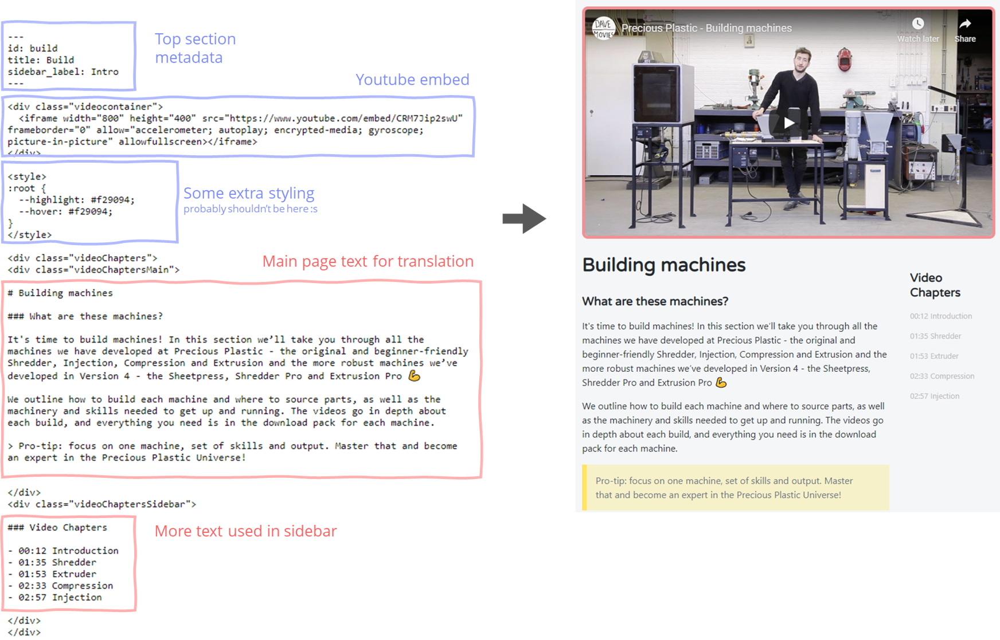
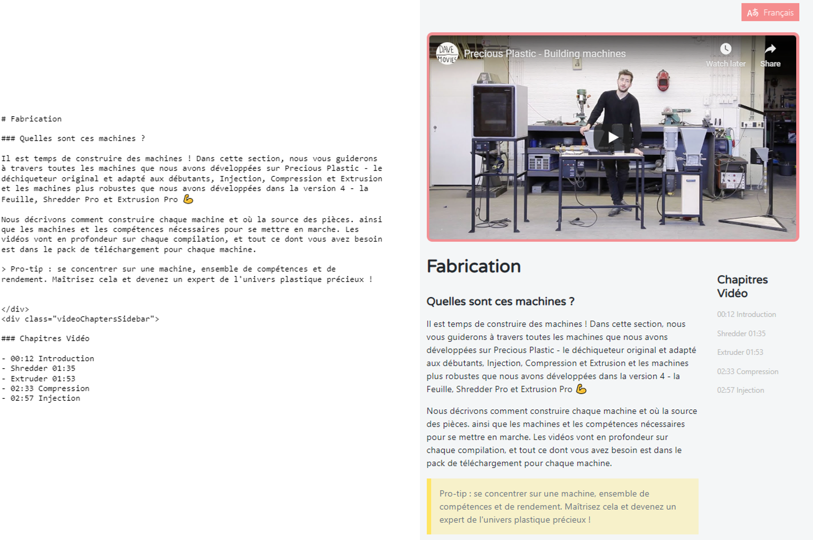
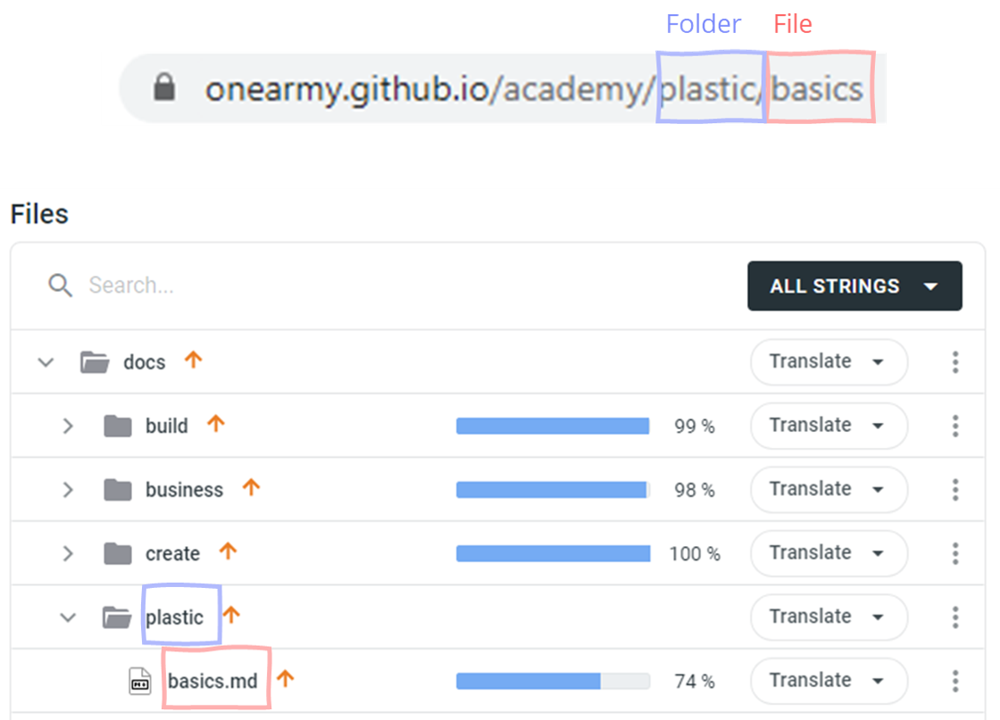
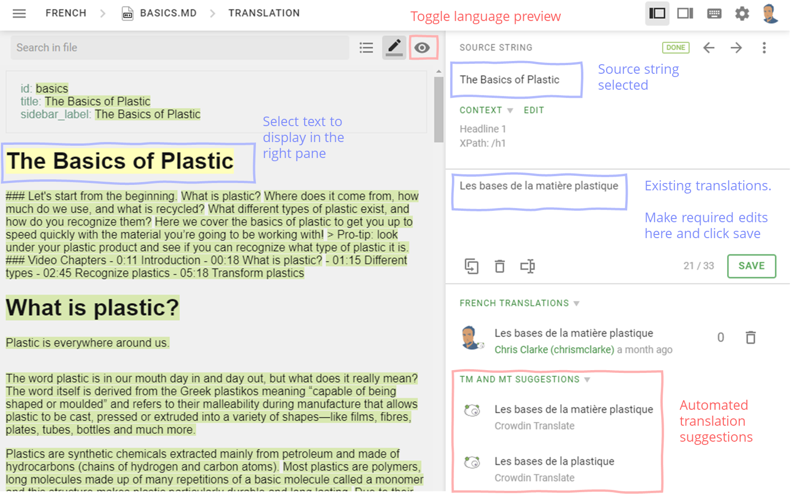
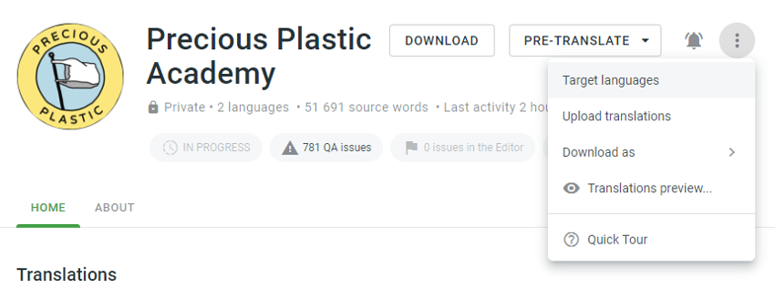

Thanks for your interest in helping to translate the Precious Plastic academy. We're still in the early stages of this process and there's a lot to figure out, but here's an overview of where we are and how people can help out.

# Overview

## How the site works
All of the content you see on the academy website is created from hardcoded text files, written in `markdown` (.md) format and converted into html by a tool called `docusaurus`. 

Here's an example of the [markdown file](https://github.com/ONEARMY/academy/blob/master/docs/build.md) and [generated webpage](https://onearmy.github.io/academy/build) for the build page

## How the translation works
The main bulk of the translation work is to take the markdown files for every page, and rewrite all the visible content in the translation language. For example, if translating into french we will need to create another `build.md` file written in french, and stored in a separate folder (currently `academy/website/translated_docs/fr`).

> There are also a few bits of text injected into pages from elsewhere (like navigation sidebars, or the page titles themselves). These also require translation, but someone still needs to outline how to do this!!

The benefit to translating file-by-file as opposed to storing individual lines of text (or relying on google translate) is that we can use the full page context to provide an exact translation for the text which can, at times, be quite technical or in need of precision.

## Managing Translations
All translations are managed online using a system called [crowdin](https://crowdin.com/). Not only does this allow multiple translators to collaborate on files, it also provides tools to track revisions across languages, apply automated machine-translation as a base for contributors to work from, and sync with github to provide final output.

>Note, there is already lots of really good documentation on the crowdin website for handling all steps of the translation process, however recently they have launched a new platform for enterprise which we are using, and currently has only limited documentation. So find some more general guidance below.

# Translators Docs

## Requesting language additions
Since launching the community platform and academy in January 2020, we've seen users visiting from all around the world (not to mention people who have hosted their own copies of the site elsewhere). 

_Community Platform User Countries - June 2020_

Whilst it would be really awesome to have all text available in the native languages of everyone who visits, that would also involve a huge amount of work for people to translate, proof-check, and maintain. The whole translation process is also pretty new, and so wil bound to have lots of challenges along the way.

So as a couple pre-requisites, before requesting additional languages it would be good to ask yourself a few questions:

- Would many people benefit from the work?
- Is there someone to manage the work?
- Are there multiple people able to spend time translating all the content (there's quite a lot!)
- Would translators have the technical knowledge to know if what is written is accurate - precision machines require precision translation!!!

>A good place start these discussions could be country community channels on the [Precious Plastic Discord](https://discordapp.com/invite/AKuxkpx).

If the answers to all of these are reasonably positive, then the next step would be to drop a message into this GitHub thread: https://github.com/ONEARMY/academy/issues/77

## Joining a translation project
Translations are hosted by crowdin, and require an account at https://onearmy.crowdin.com/. Once you have an account, you will need to let the project manager for your language know either your username or email, and they can send an invite to the specific translation project.

> Don't know who the project manager is? No problem, take a look through the discussion at https://github.com/ONEARMY/academy/issues/77 and hopefully it will say. Otherwise you could always try ask around on discord.

## Loading translation files
From the project homepage, click on a language to see the full list of files for translation. 

The folder structure follows the same structure as the website, so if for example you wanted to translate https://onearmy.github.io/academy/plastic/basics page, you can see the file at `plastic/basics.md`

Simply click on the row for the file you want to work on and you will be taken to the translation editor. Alternatively use the dropdown and go to the `translations` section

## Adding or editing translations
From within the editor you can select any piece of text on the left, and view existing translations and make suggested changes on the right.

 

Once you have finished a piece of text you can either manually select another, or use the arrows or keyboard shortcuts to go to the next. You can also toggle between English and translated versions using the preview icon. Once a file is complete you can select another from the filename dropdown. 

## Seeing the changes on a live site
Before changes appear on the live translations preview site they must first be approved by a manager, and then merged into the codebase by a member of the dev team. A request to merge will be created automatically on approval, and should appear at: https://github.com/ONEARMY/academy/pulls. 

Once approved the site will be deployed to a live preview at:
https://pp-academy-translation-demo.netlify.app/

Integration into the final public academy site takes one more approval step from the lead developers, who will merge the changes into the master branch of the repo.

>By default all translations will be merged in and appear live, in the future we will likely need to find a better system to know which languages are ready for inclusion on live or not.

# Managers Docs
## Adding languages for translation
Anybody with Manager priviledges can add more languages for translation. To do this simply go to the `target languages` menu from the project home dropdown.

## What about specific dialects or languages not listed?
Additional languages can be added as [custom languages](https://support.crowdin.com/changing-target-languages/), however before doing this it is recommended to check with developers whether the platform is capable of supporting these.

## Inviting translators
This can be one via email, or by adding a user's username from the `Members` page. 
>It is also possible to create links for sharing, however in the past we have found them to be a bit termpermental (expiring after single use). Feel free to try though!

## Handling changes to source files
From time to time small changes might be made to source files, as users point out typos, corrections, clarifications etc. Once these have been made to the default english version of the files, they will show up as requiring translation within the project home page.
> Note, notifications can be added on both the project level to inform translators of updates to text, as well as at a personal level to decide if and how notifications are received. This isn't currently configured, but could be done in the future.

Crowdin will automatically detect some minor changes (such as punctuation changes), and offer suggestion with an `autofix` button to implement.

For other smaller changes (such as word changes), crowdin will use it's bank of all previous translations to automatically detect and suggest translation changes. These should be reviewed by the manager and can usually be updated pretty quickly.

For larger changes, such as addition of new files, or large text changes then it is likely that maangers will want to assign the file back to translators for translation.

## TODO
- General workflow
- Automated (google) translations
- User permissions
- Contacting translators
- Handling conflicts, translation voting system
- Super managers docs (e.g. handling page changes/additions, multiple country overview)

## 

# Developers Docs
## TODO
- Adding languages to dropdown
- Translating injected text and other custom scripts
- Git translation branches
- Merging, building and generating previews
- Translations api and integrations 
- Direct In-context translation feature (future possibility)