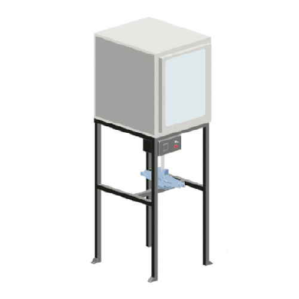

  <iframe width="800" height="400" src="https://www.youtube.com/embed/CRM7Jip2swU" frameborder="0" allow="accelerometer; autoplay; encrypted-media; gyroscope; picture-in-picture" allowfullscreen></iframe>

# Building machines

### What are these machines?

It's time to build machines! In this section we’ll take you through all the machines we have developed at Precious Plastic - the original and beginner-friendly Shredder, Injection, Compression and Extrusion and the more robust machines we’ve developed in Version 4 - the Sheetpress, Shredder Pro and Extrusion Pro 💪

We outline how to build each machine and where to source parts, as well as the machinery and skills needed to get up and running. The videos go in depth about each build, and everything you need is in the download pack for each machine.

> Pro-tip: focus on one machine, set of skills and output. Master that and become an expert in the Precious Plastic Universe!

### Video Chapters

- 00:12 Introduction
- 01:35 Shredder
- 01:53 Extruder
- 02:33 Compression
- 02:57 Injection

## Why are these machines important?

We didn’t invent plastic processing machines. They already exist in the industry and can process new products at lightning speed - they’re almost too efficient, which is a contributing factor to the amount of plastic waste we have globally. But working with recycled plastic can be unpredictable and this is why the industry doesn’t want to work with it - it’s easier, cheaper and more reliable to use clean virgin plastic.

So we based our machines on those in the industry but made them cheaper, easier to build and much more affordable:

This inclusive approach increases accessibility and adoption worldwide and are developed using basic technologies and materials so they are easily understood, reproduced and repaired by people from all over the world with basic metal and building skills. And since we’ve been doing this together with you (our community) for many years, it’s easier than ever to understand how to build these machines in your local community and get support from local builders and suppliers. And we love seeing you hack them and making them better!

> Pro Tip: Use the map to see which machines are in your local area!

### Our machines

The underlying principle behind the machines is the same for all (except the shredder). Each machine applies heat to plastic, plastic melts, gets pressed into a mould or shape and is finally cooled to regain its solid state. That’s all the magic behind recycling. Pretty simple, right? Each machine is unique with its own workflows, outcomes, precautions, behaviours and problems but the fundamental concept is the same. The more you’ll work with them, the more you’ll understand them and get better at recycling. So let’s dive in!

| Machines   |  Description |
|----------|----------------------|
|            | __Shredder__   Our Shredder chops the plastic into small flakes that can be used by the other machines to melt. Get the Shredder Pro for higher outputs.   |
|         |  __Extrusion__   Shredded plastic goes in, gets molten and turns into a string of plastic. You can freestyle and wrap it around a mould or fill up moulds. Get the Pro version for higher outputs |
|      |  __Injection__   Simple to build and use machine. Plastic melts in the barrel and is squeezed into a mould. You can make basic objects or super detailed. Good for education and small productions.   |
|   |  __Compression__   An oven that can heat up your plastic in a mould and compress it together. It's good for experimenting and learning but not strong for productions. |
|  |  __Sheetpress__   Big machine that can make big sheets. It can process a lot of plastic on a daily basis. It's a relatively new process, so there are still some things to learn and figure out :) |
|  |  __Extrusion Pro__   A beefed up version of our smaller extruder. Made to run long hours and outputs more plastic. Its the extruder you can count on for big productions.   |
|  |  __Shredder Pro__   Big version of our small shredder, the main difference is that this is a 2 axel machine. Good for quickly shredding plastic into small flakes. Less good for granulating.  |

**If you need help, have questions or looking for someone to talk to in your lonely cold workspace. Head to the [#build](https://discordapp.com/invite/XQDmQVT) channel on Discord. Here we talk nerdy about machines.**
