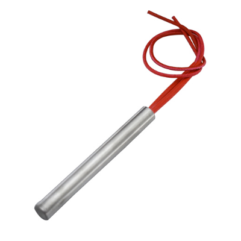
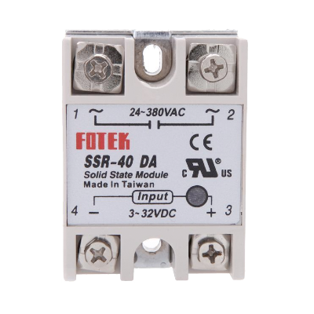

# Overview of components (draft)

|  Component    |  Name   | Used in  | Buy  | Learn more |
|----------------|----------------|------------|--------|--------|
|    | __Cartridge heater__   Used to heat the aluminium blocks in the sheetpress   | Sheetpress     | online, online  | [forums](https://davehakkens.nl/community/forums/topic/the-big-electronics-topic/)|
|    | __PID controller__   Measures the temperature from thermocouples and uses it to turn on heating elements  | Extruders, injection, sheetpress, compression      | online, online   |[forums](https://davehakkens.nl/community/forums/topic/the-big-electronics-topic/)|
|   | __Thermocouple (type K)__   Measures the temperature and send it to the PID    | Extruders, injection, sheetpress, compression       | online, online    |[forums](https://davehakkens.nl/community/forums/topic/the-big-electronics-topic/)|
|   | __3 Phase Plug__   Connects the powercord with the wall socket     | Extruders, Shredders, injection, sheetpress     | hardware store, online   ||
|   | __Relais__   Uses the low (5V) output from the PID controller and Arduino to switch high current (380V)   | Shredders, Extruder Pro, Sheetpress      | electronic shop, online    |[forums](https://davehakkens.nl/community/forums/topic/the-big-electronics-topic/)|
|   | __Solid state Relais__   Uses the low (5V) output from the PID controller to switch heating elements  | Extruders, injection, sheetpress, compression      | online, online    |[forums](https://davehakkens.nl/community/forums/topic/the-big-electronics-topic/)|
