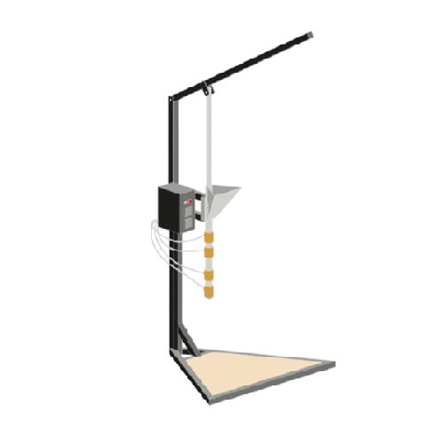

  <iframe width="800" height="400" src="https://www.youtube.com/embed/qtZv96ciFIU" frameborder="0" allow="accelerometer; autoplay; encrypted-media; gyroscope; picture-in-picture" allowfullscreen></iframe>

# Build an Injection Machine

### What is this machine?

The injection machine has a quick production output with high precision, while it takes a little bit more effort in the beginning with designing and making a mold, you’ll be amazed at what you can create. Shredded plastic enters the hopper and is heated and pressed through a long barrel into your mold. The output colour is often unpredictable when mixing colours in the barrel, allowing for beautiful (and surprising) patterns that can add to your one-of-a-kind products.

> Pro-tip: Invest in a good mould. Good mould, good output :)

> Pro-tip: A new improved version of the injection machine which can be disassembled and has some additional safety features can be found in the [library](https://community.preciousplastic.com/library/injection-machine---designed-for-disassembly). If you are building a new one consider taking a look at this one before ordering parts.

### Video Chapters

- 00:07 Introduction
- 00:43 Hopper
- 02:01 Barrel
- 03:58 Nozzle
- 04:53 Framework
- 06:55 Electronics
- 10:30 How it works

# 📓 Technical information

📓 Type | Injection
--- | ---
💎 Version | 1.0
💰 Price new material in NL | +/- €300
💰 Price scrap material in NL | +/- €150
⚖️ Weight | 23 kg
📦 Dimensions | 830 x 700 x 1300 mm
⚙️ Barrel volume | 150 cm³
⚙️ Leverage | 3
⚙️ Injection pressure | 45 bars
⚙️ Max mould size | 360 x 330 mm
⏱ Injections p/h | 10 - 30    
🔌 Voltage | 220V    
⚡️ AMP | 2.6A
| ♻️ Input Flake Size                   | Medium, Small  |

# 🌐 3D Model
<iframe width="500" height="500" src="https://b2b.partcommunity.com/community/partcloud/embedded.html?route=embedded-viewer&name=Injection+Basic+V2.0&model_id=96645&portal=b2b&noAutoload=true&autoRotate=false&hideMenu=true&topColor=%23dde7ed&bottomColor=%23ffffff&cameraParams=false&varsettransfer=" frameborder="0" id="EmbeddedView-Iframe-96645" allowfullscreen></iframe>

# 🛠 Required machinery & skills
Build Injection  | Machines needed | Skills needed
--- | ---| ---
  | - Drill press   - Welding machine (not specific)   - Angle grinder | - Welding (intermediate)   - Assembling (intermediate)   - Electronics (intermediate)

# ⚡️ Electronic box
Explanation of the electric components inside this machine. More information and schematics can be found in the download-kit.

* <b>PID Controller:</b> the brains of the machine where you can set your desired temperatures. It will send power to the heaters until PV (point variable) matches the SV (set value). It does this using readings from the thermocouple and the SSR.
* <b>SSR:</b> the Solid State Relay is an electronic ‘switch’ that opens and closes depending on the signal it receives (from the PID).
* <b>Thermocouple:</b> basically a thermometer.
* <b>Band heater:</b> heating element that fits around a pipe.
* <b>Power switch:</b> mechanical switch.
* <b>LED indicator:</b> LED that will shine with power (often found with Power switch).
* <b>Power cable:</b> common household power cable.

> Pro-tip: Here is a [good forum topic about electronics](https://davehakkens.nl/community/forums/topic/the-big-electronics-topic/)

# 🛠 Tips & tricks while making

- Take care welding around the hopper tabs. The heat can easily distort the barrel, ruining that perfect slide.
- Adding an insulated barrel cover will increase efficiency and reduce the chances of the user accidentally touching the barrel when hot.  
- When building, the lever is stronger as a circular profile when compared to a square profile. Which will reduce the likelihood of bending it.

# ♻️ Input & Output
<b>Type:</b> HDPE, LDPE, PP, PS 
<b>Output:</b> 10-30 injections per hour depending on mould 

# ⚙️ Run & maintain

You can create beautiful, consistent products with the injection machine very efficiently, but it takes a little work upfront - making moulds, for example. The more precise the mould, the easier and more streamlined your production will be. Some quick tips:

### Startup
1. Turn the machine on and set the temperature to 20° more than the desired temperature. Make sure the lever is at its lowest position.
2. Wait for at least 20 minutes.
3. Turn the temperature down and fill the barrel with the desired plastic.
4. Wait another 15 minutes for the plastic to melt - the first batch of plastic is used to rinse the machine and to get rid of plastic from previous sessions.
5. Press the first batch of plastic out of the machine.
6. The machine is now ready for production!

### Production
1. The machine is now warm and ready to use with your moulds
2. Fill the barrel with your chosen plastic.
3. Press the lever in the barrel.
4. Pull the lever up every 5 to 10 minutes and add more plastic.
5. Wait at least 10 minutes.
6. Now for the mould - unscrew the brass screw at the bottom.
7. Screw in the mould (be quick or plastic will start to flow out!)
8. Once the mould is secured to the machine pull the lever down as far as possible, don’t be scared to give it a lot of pressure, it can easily hold 100kg.
9. Unscrew the mold from the machine.
10. Pull the lever up.
11. Screw the brass screw in place.
12. Fill the machine for a new product.
13. Let the mould cool.
14. Open the mould once it is cooled down.

> Pro-tip: Depending on the plastic type, you’ll need one or sometimes two people to pull down the lever.
Before injecting into the mould, make sure the plastic in the barrel is completely melted in order to fill all areas of the mould. To achieve this, run the machine a few degrees higher than usual to ensure the plastic is fully molten.

### Cooldown
1. When you turn on the machine, empty the barrel completely - this makes it easier for the next person using the machine.
2. Leave the machine with the lever all the way down.
3. Turn the machine off.

### Tips & Tricks while using

1. The hotter the plastic the greater the sink marks on the final product.
2. Clean the mould from plastic when still warm, it will be harder to clean later.
3. Use mould release on the mould, it helps with release.
4. Keep the barrel full with plastic at all times, adding a bit of plastic with each injection.
5. When you are finished working with the injection machine, empty the plastic from the barrel.
6. To create an efficient process it is advisable to run the machine for a few hours once it is on - don’t start and stop the machine too often as the process will be very inefficient.

# 🔓 Troubleshooting
* If the plastic is clogging at the end of the barrel and doesn’t come out even when applying higher pressure, raise the temperature of the nozzle heater to fully melt the plastic and release the block. 
The final product might get stuck to the mould making it hard to release, if this happens gently re-heat the mould to soften the plastic and help release.

# 🌦 Pros & cons
Pros | Cons
--- | ---
Easy to manufacture     | Process can be tedious|
Runs on 220V | Only a small amount of waste recycled|
Relatively cheap ||
Batch production ||

# 🌎 Built by the community

# 🙌 Useful Links
- [Project: Injection Machine - Designed for disassembly](https://community.preciousplastic.com/library/injection-machine---designed-for-disassembly) 
- [Upgrade: Make a Quick Release Mould](https://community.preciousplastic.com/library/make-a-quick-release-opening-system-for-injection-moulds) 
- [Hack: Benchtop Injector](https://davehakkens.nl/community/forums/topic/benchtop-smaller-machines/) 
- [Hack: Injection Nozzle Refinement](https://davehakkens.nl/community/forums/topic/injectionextrusion-nozzle-refinement/)
- [Project: Carabiner](https://community.preciousplastic.com/library/make-a-carabiner-cnc-vs-lasercut) 
- [Project: Quick Release](https://community.preciousplastic.com/library/make-a-quick-release-for-the-extrusion-machine) 
- [Project: Cast Aluminium Moulds](https://www.youtube.com/watch?v=5LhHUBz9uL0) 
- [Project: CNC iPhone Case Mould](https://www.youtube.com/watch?v=ZYFoWP-3MYE) 
- [Project: Geodesic Dome](https://community.preciousplastic.com/library/build-a-geodesic-dome) 
- [Project: Precious Plastic Monash Machine](https://www.preciousplasticmonash.com/download-kit) 
- [Project: Handplane](https://community.preciousplastic.com/library/make-a-handplane-simple-mould) 
- [Project: Broom Hanger](https://community.preciousplastic.com/library/make-a-broom-hanger) 
- [Development: The Story Behind the Piranhaclamp](https://davehakkens.nl/community/forums/topic/the-story-behind-the-piranhaclamp/) 

Are you interested to connect with the Precious Plastic community? Perhaps you want to learn more or share your own knowledge. Well you're in luck! We have created a <a href="https://community.preciousplastic.com/questions">Questions</a> section for the community to collaborate. Now if you want to chat with people locally and globally, check out the <a href="https://discord.gg/gwkbpsWbAB">Discord</a>

