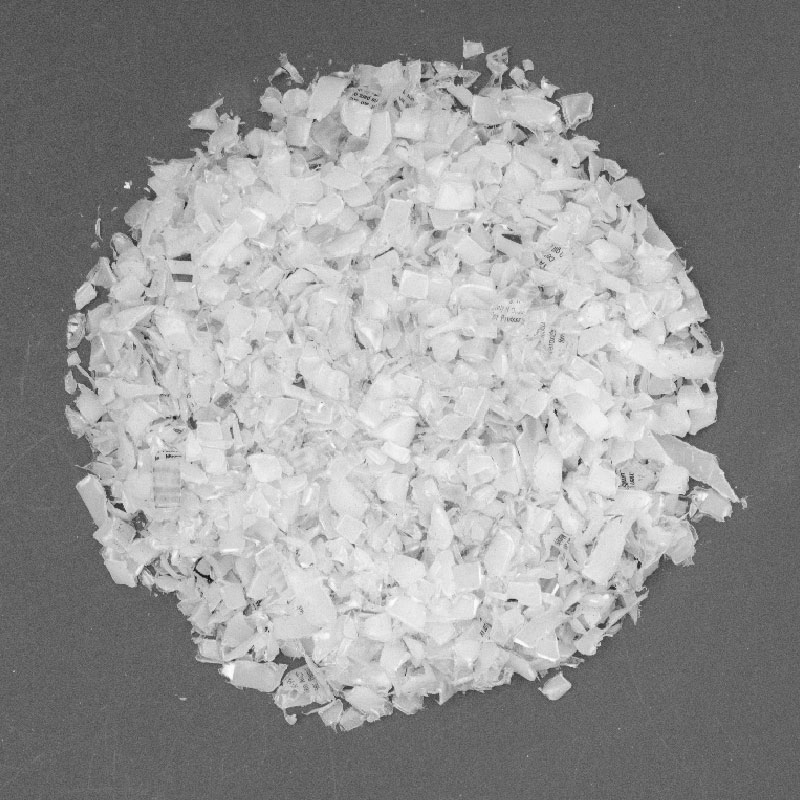

# 📓 Shredder Pro information

| Name  |  Shredder Pro     |
|----------|-------------|
| 📓 Type   |     Double Shaft Shredder   |
| 💎 Version   |     1.0   |
| 💰 Price new material in NL |  +/- €2200 + motor |
| ⚖️ Weight |   340 kg   |
| 📦 Dimension   | 1205 x 550 x 1512 mm|
| ⚙️ Blade width | 6 mm|
| 🔌 Voltage | 400V|
| ⚡️ AMP | 16A|
| ⏱ Monitoring interval time | 1h|
| ⚙️ Geared Motor   |       |
|  - Nominal Power |  2.2 kW minimum. 3-4 kW recommended |
|  - Nominal Torque |   1100 Nm minimum - 3000 Nm max   |
|  - Output Speed   | 15-25 r/min|
|  - Minimum Service Factor   | 1,5 (2,2kW) / 1,2 (3kW)|

# 🌐 3D Model
<iframe width="500" height="600" src="https://b2b.partcommunity.com/community/partcloud/embedded.html?route=embedded-viewer&name=Shredder+Pro+v1&model_id=96615&portal=b2b&noAutoload=true&autoRotate=false&hideMenu=true&topColor=%23FFFFFF&bottomColor=%23ffffff&cameraParams=false&varsettransfer=" frameborder="0" id="EmbeddedView-Iframe-96615" allowfullscreen></iframe>

# 🌦 Pros & cons

### Pros    

Compared to previous Precious Plastic machines, this shredder is very robust and reliable. Everything has been calculated and dimensioned to handle the high stresses required to shred plastic.

Most industrial shredding systems require a shredding phase and a granulating phase. Thanks to the adjustable meshes, this machines is capable of carrying out both tasks!

This machine is designed for relatively easy assembly. No welding is required for the core shredding box, and all further welds are straightforward.

This shredder has also been designed to be easy to clean. In less than 30 minutes the shredder can be cleaned and ready for a different type of plastic, allowing community members to produce small batches of plastic.

### Cons

Granulating is possible with only this shredder, but this step will still be slightly slower than with a dedicated industrial granulator. This machine is mainly for shredding, polyvalence came with a price.

Compared to original V3 Precious Plastic machines, this machine is harder to build even though we tried to keep things simple. You’ll need proper machines and skills.

This machine also requires specific equipment and a high powered motor making it a little harder to build from scrap. Be sure to fully read the bill of material to procure your components as your machine reliability depends of it.

# ♻️ Input & output

The machine can shred any plastic in any shape that fits between the blades. We have tested it with HDPE, PP, and PS. There is no limit of thickness that the shredder can handle. If the plastic piece is too thick, the blades will not shred as it has been designed so that plastic cannot jam the machine (depends on the motor power). PP, HDPE, PS from 0.7mm to 12mm have been tested successfully. Films are too thin and will slide in between the blades.  Rubber, tires, and thermoset plastics have not been tested.

### Definition of our flakes sizes
The shredded plastic can be used in three different Precious Plastic machines: extruder, injector, and Sheetpress. Thus, we have defined three different sizes of shredded plastic that work with each machine

Name: | Large | Medium | Small |
--- | ---| ---| ---|
Visual: |  | | 
Size: | 0-30 MM| 0-10 MM | 0-7 MM|
Works with: | Sheetpress| Sheetpress   Injection   Compression | Sheetpress   Injection   Compression   Extrusion|

To obtain these sizes, you need to use the right mesh. Install a 7mm sieve on the shredder to get small flakes or a 10mm sieve to get medium size. You can get the larger size without the use of a sieve. Depending on the size of the input material, you might need to shred several times to get the desired size.

### Output and speed
| Material | Description | Times shredded | Output (Kg/h) | Sieve | Size |
|---|---|---|---|---|---|
| HDPE | Shampoo bottles | 1st time  | 36,7 | No  | Too big  |
|   |   |  2nd time | 375  | No  |  Large |
|   |   |  **Total** |  **30.9** |   | **Large**  |
| PS | Transparent CD cases | 1st time  | 9.8 | No  | Medium  |
|   |   |  2nd time | 86.5  | 7 mm sieve  |  Small |
|   |   |  **Total** |  **8.8** |   | **Small**  |
| PP | Bottle caps | 1st time  | 76.7 | No  | Large  |
|   |   |  2nd time | 92  | 10 mm sieve  |  Medium |
|   |   |  **Total** |  **41.8** |   | **Medium**  |

# 🙌 Useful Links
* [ Buy or sell parts & machines on our bazar](https://bazar.preciousplastic.com)
* [ Find a local machine shop on our map](https://community.preciousplastic.com/map)
* [ Visit our how-tos for upgrades and hacks](https://community.preciousplastic.com/how-to)
* [⭐️ How to setup a full Shredder workspace](spaces/shredder.md)
* [⭐️ For questions go to our #build channel in Discord](https://discordapp.com/invite/XQDmQVT)

Are you interested to connect with the Precious Plastic community? Perhaps you want to learn more or share your own knowledge. Well you're in luck! We have created a <a href="https://community.preciousplastic.com/questions">Questions</a> section for the community to collaborate. Now if you want to chat with people locally and globally, check out the [Discord](https://discord.gg/gwkbpsWbAB).

