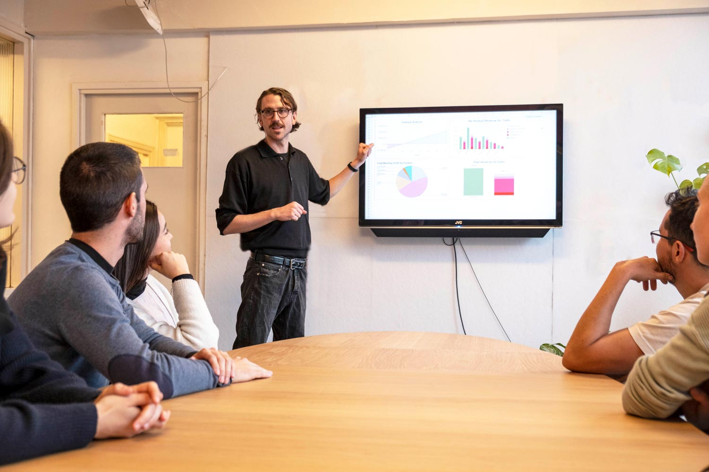

# The Business Tools

### So how can you make money out of recycling plastic?

We are excited to take you through some crucial tools to help you not only have an impact in your local community, but to become financially sustainable so you can do it for a long time. Joseph (our Business Guy) is going to take you through the following three tools to go from nothing, to having a business!

Pro-tip: the most successful businesses are the ones that really focus on what they want to deliver to their customers or audience

## The Business Tools is a three part series consisting of:

- The <b>Action Plan</b> is a quick and dirty business plan for you to plan your business model
- The <b>Workspace Calculator</b> is a financial forecasting tool for you to understand the financial viability of your workspace
- The <b>Business Plan Template</b> is where you roll everything together and create a more long form business plan

Let's get started!
