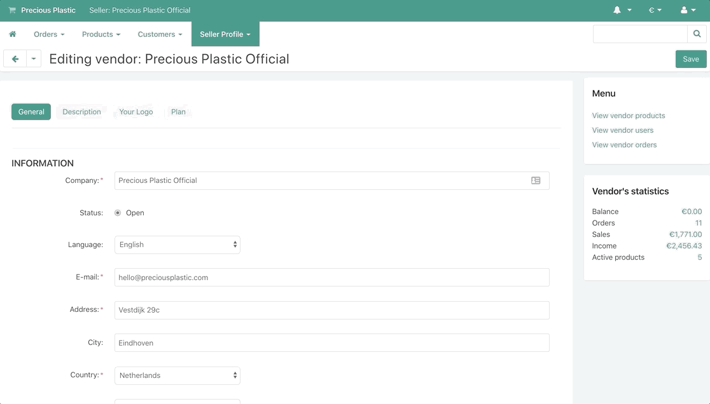
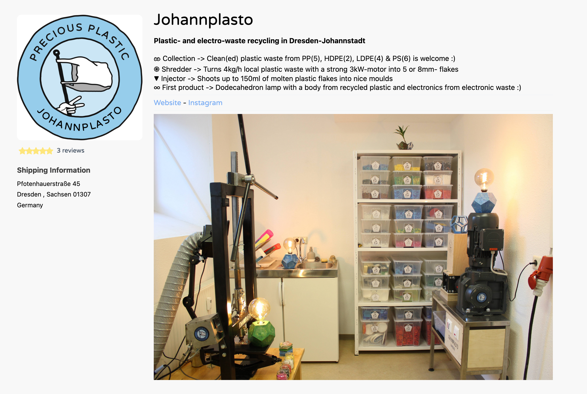
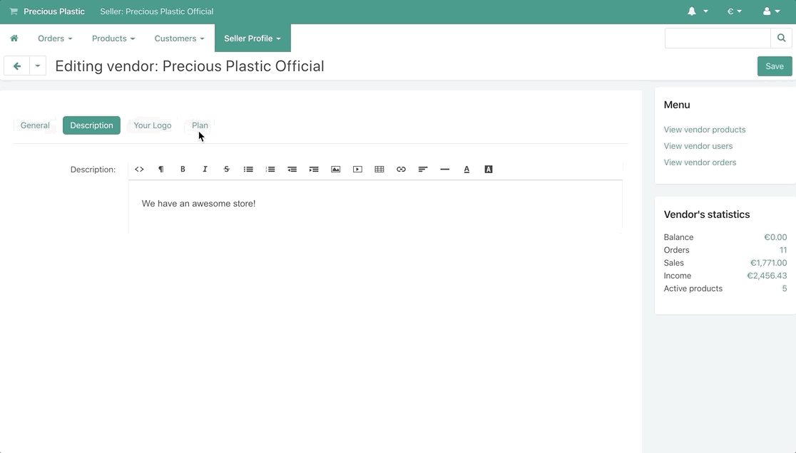
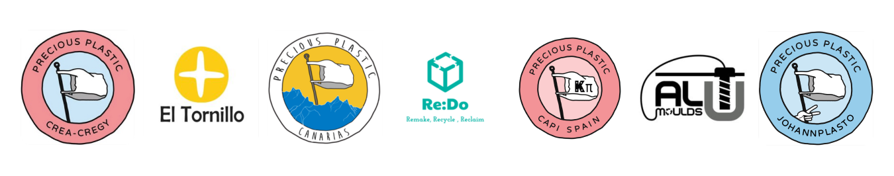
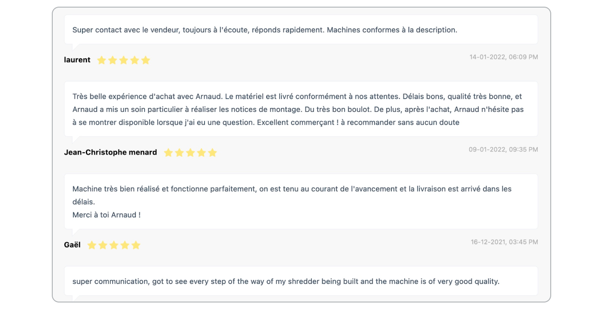

# Set up your Seller account

Cool that you want to start selling on the Precious Plastic Bazar! Have you **[signed up](https://bazar.preciousplastic.com/index.php?dispatch=companies.apply_for_vendor)** for a seller account and recieved an email approval of your account already? Then let's go through the steps to get you set up properly!

To build and strengthen your business on the Bazar, it's important to have a trustworthy and unique profile.

**Here are some Guidelines on how to set up an appealing profile.** 

> Info: Only listings with proper seller profiles will be **promoted on the Bazar homepage**, which will help to increase your visibility and sales.

## 1. Go to your seller profile 

Login to your seller [Dashboard](https://bazar.preciousplastic.com/vendor.php?dispatch=auth.login_form&return_url=vendor.php) and open your seller profile.

## 2. Complete your profile information

- Check your profile information for accuracy.
- Also **add your location** to create your pin on the seller
[map](https://bazar.preciousplastic.com/index.php?dispatch=companies.catalog). This can help your local community to find you.

## 3. Add a description

A detailed description helps potential buyers know you and your organization. Tell them your story of how you got started and what your focus is.

A complete description of your business should state: 

* who you are
* what you stand for (mission/motivation)
* what your companies main activities are
* previous references, etc.

Additionally, you can also add a photo of your workspace or shop to give some personality and a better impression of your project.

> Any relevant information that will provide detail to the customer on your business and make them **trust in your profile** and feel comfortable to purchase your items.

*Example:*

## 4. Add your logos

Make sure to make your profile recognisable by uploading a logo to your account. We recommend to use your company logo (if you don’t have any, you can create one with our [logo generator](https://community.preciousplastic.com/academy/universe/yourlogo)).

- The first logo is what will appear as your profile picture
- The second logo is what will appear on your invoices to customers

The recommended size for your logos is **250x250 pixels**, and the total size must be **under 5 MB**

## 5. Give options to pay

In order to make sales on the Bazar, it is required to set up **at least one payment option** (duh!).

In order to increase your group of potential customers, try to set up both payment options - **Credit Card and Paypal** - to respond to most of the potential needs.

If you need more information on how to set up payment options, please refer to the Guide to [Set up your payment method](https://community.preciousplastic.com/academy/business/Setup_Payment).

# All set? Happy selling!
If you fulfilled all of these steps, your profile should be set up well to sell and **perform well on the Bazar**. 

To **get the most out of your listings** and increase your chances to get good sales and and promoted on the Homepage, follow our[Guidelines for creating good Bazar listings](https://community.preciousplastic.com/academy/business/Image_Size_Guidelines).

## Get your reviews

Reviews from customers reflect the purchase experience and can feedback on: the quality of your communication, your item quality, delivery experience etc.

They are publicly visible and can act as your portfolio, which serves as an **indicator for potential customers** to decide to buy or not buy from you.

We therefore strongly recommend you to ensure a **high quality of service** through your exchanges with the customer.

If customers do not leave a review on their own, you can **set your order status to “Awaiting review”** which will notify them with a reminder to write a review.  

## Questions? Feedback?

Good luck and feel free to reach directly to us for help or if you think we’ve missed important tips on improving sellers listings. 

You can find us daily on Discord on the [#🙌bazar-seller channel](https://discord.gg/2E93VxB3CD) or can send us an email to **bazar@preciousplastic.com**.

