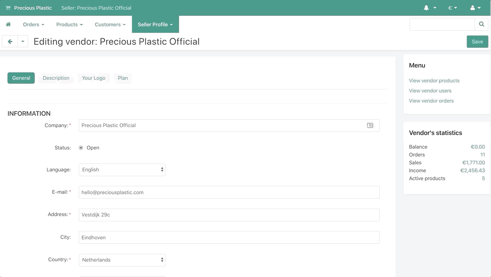

# Set up your seller account 👐
Cool that you want to start selling on the Precious Plastic Bazar! Have you **[signed up](https://bazar.preciousplastic.com/index.php?dispatch=companies.apply_for_vendor)** for a seller account and recieved an email approval of your account already? Then let's go through the steps to get you set up properly!

## 1. Login to the Seller [Dashboard](https://bazar.preciousplastic.com/vendor.php?dispatch=auth.login_form&return_url=vendor.php) 

## 2. Go to your seller profile

 
## 3. Check your profile information for accuracy 

## 4. Add your seller map location to create your pin on the seller [map](https://bazar.preciousplastic.com/index.php?dispatch=companies.catalog)

## 5. Add a description
- A detailed description helps potential buyers know you and your organization. 
- Tell them your story of how you got started and what your focus is. This seems trivial but could be the difference between a sale or not.

## 6. Add your logos 
- The first logo is what will appear as your profile picture
- The second logo is what will appear on your invoices to customers
- The recommended size for your logos is 250x250 pixels, and the total size must be under 5 MB

## 7. Set up your payment method!
- Finally, in order to receive money, you will have to set up your payment method.
- Go to this guide to show you [how to set up your payment method.](https://community.preciousplastic.com/academy/business/Connect_Stripe)
