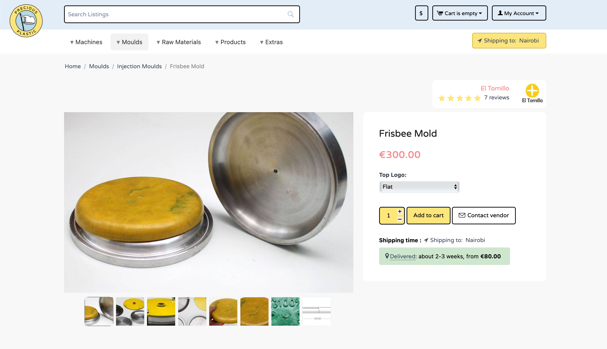

# Bazar Explained
The **[Precious Plastic Bazar](http://bazar.preciousplastic.com/)** is a peer to peer marketplace for connecting buyers and sellers of Precious Plastic machines, moulds, raw materials and products. Everything listed is created by Precious Plastic workspaces around the world. A great tool for connecting with other workspaces and finding the items you need to start or improve your workspace 👊

## Want to buy from the Bazar?

The Bazar works a lot like other e-commerce platforms you can find on the world wide web. Here’s the process: 

1. Search listings or browse by category .
2. Find offers from various sellers around the world (buy local if you can 🌍).
3. Add items to your shopping card.
4. Check out and pay with Credit Card or Paypal. **You will have to check out PER seller, as the payment goes directly to the seller.**
5. Receive your items.
6. Give a review to the seller to help the community.

> Precious Plastic receives a **5% transaction fee** when items are purchased through the Bazar, which helps us pay the costs of running the platform and improving it over time 💪

## Want to sell on the Bazar?
If you're workspace is up and running and you want to **[sell](https://bazar.preciousplastic.com/index.php?dispatch=companies.apply_for_vendor)** on the Bazar, there are a few requirements you should know before getting started.

* You need a **registered business/organisation** (it's required by the payment processor).
* You agree to **finish transactions on the Bazar** which started there. It's not allowed to ask customers to email you off the platform to use your own payment methods. Going around the platform to avoid the transaction fee hurts the platform and the Precious Plastic Community.
* All transaction issues need to be resolved **between seller and customer**. Precious Plastic is not responsible for disputes.
* Connecting a **payment account** is required before publishing your listings.
* Read and accept the [Terms and Conditions](https://bazar.preciousplastic.com/terms-and-conditions/).

> You can find guides to get started as a seller here on the Academy - best is you start with [setting up your account](https://community.preciousplastic.com/academy/business/Account_Setup).

## Enjoy :)
Have fun browsing, buying, selling and supporting grassroots recyclers!
