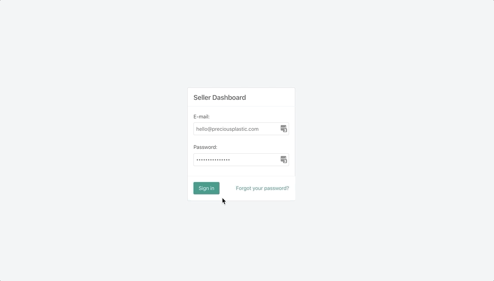

 
# Connect Your Stripe Account 

## Payments power the bazar 💸 

Stripe is the payment processor that powers the Bazar. You need a seperate account with Stripe, which allows you to manage all the information related to payments. Remember that it's required to have a connected Stripe account before posting listings. 

## Login to the Seller [Dashboard](https://bazar.preciousplastic.com/vendor.php?dispatch=auth.login_form&return_url=vendor.php)

## Go to payment methods

Login to the seller dashboard.
Go to Administration/ Payment methods.
Click on ‘+’- to add one.

## Scroll down and click "connect with Stripe" 

## Set up a new account or connect an existing one 
- Creating an account is free
- You must have a registered organization in a Stripe supported [country](https://stripe.com/global)
- If your country is not supported, you can try setting up an account through Stripe [Atlas](https://stripe.com/atlas), or find another creative way around it
- Paypal is not supported

## You're now open for business 🙌🏼🎉💪
- Next step is to create lisitngs on the Bazar and start selling 🤑
