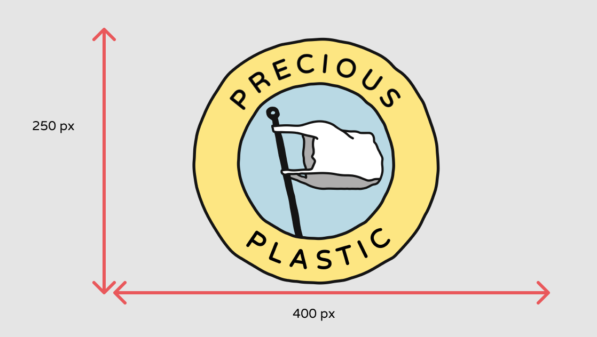
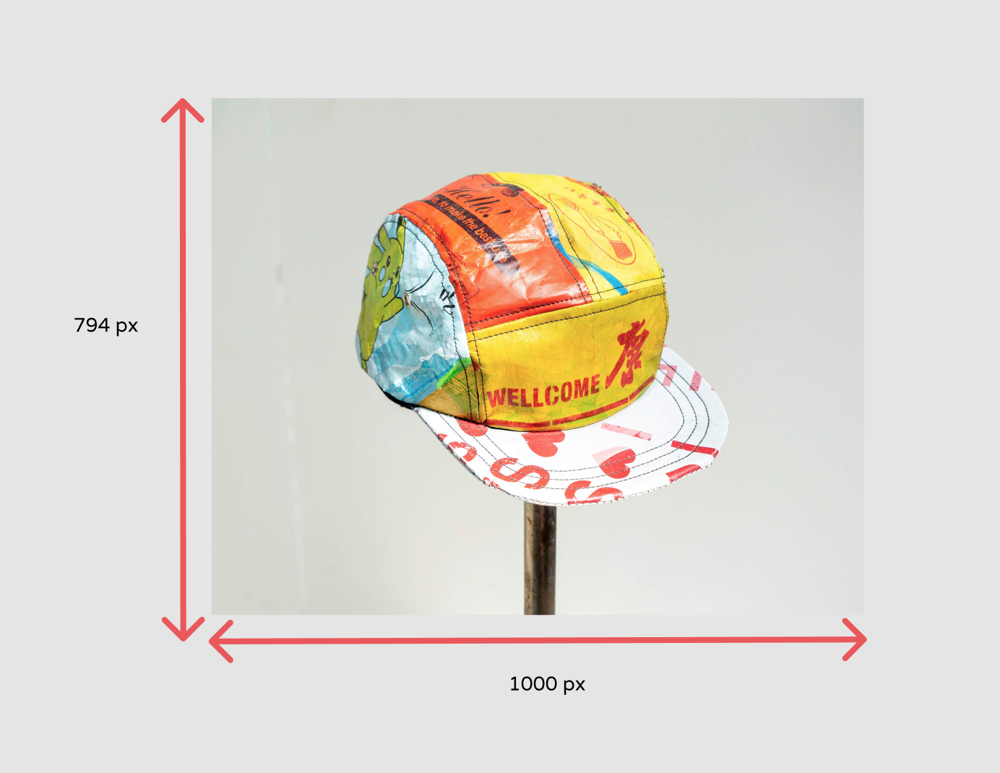

 

# Image Size Guidelines 

## Logo Images

The recommended size for your logos is **250 x 400 pixels**, and the total size must be under **5 MB**. Image file types allowed are .jpeg and .png

## Product Images

Horizontal (landscape) images are highly encouraged for maximum visibility. The minimum recommended product image size is **794 x 1000 pixels** with a resolution of 72ppi 

