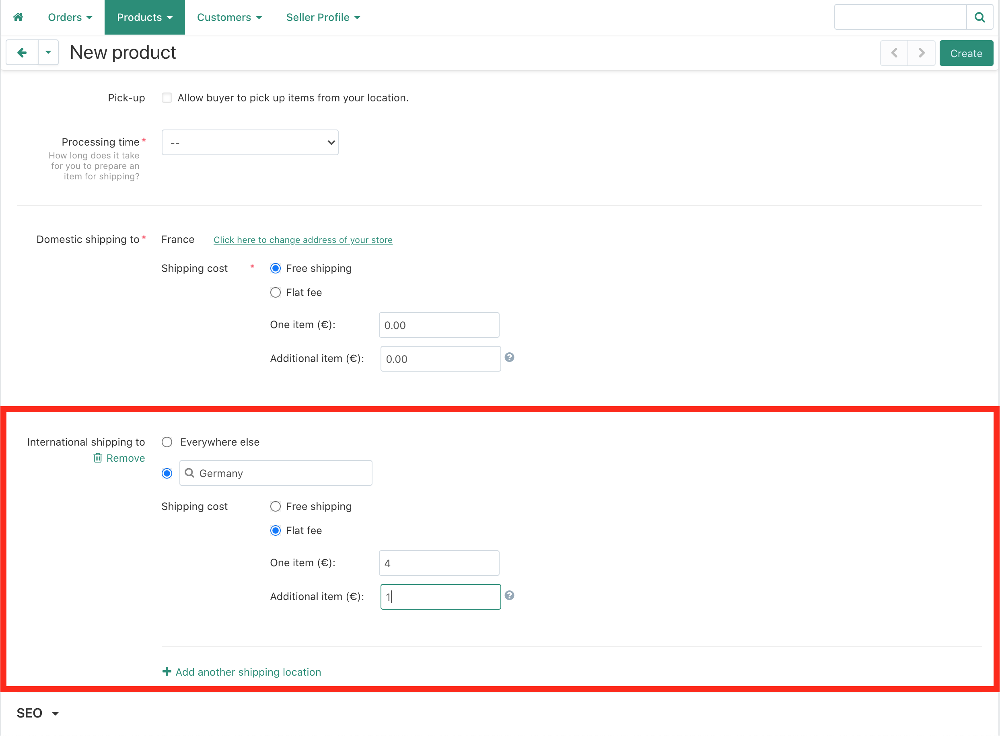

 

# Add International Shipping Options to Sell More Products 
Users from all over the world visit the Bazar on a daily basis. It’s important for sellers to have their international shipping options setup so they can purchase the listed items.  

## Why you should add international shipping options

Without international options for shipping your items, international customers cannot make a purchase. They can send the seller a message to ask them to add their location, but the sale may be lost in this process. It’s a smoother experience for the buyer if the options are already set up. This should greatly increase sellers' sales on the Bazar. 

## First add your domestic shipping option 
It’s required to add a domestic (your country) shipping option for saving a listing on the Bazar. 

## Now click “add another shipping location” to add international options 
Next fill in shipping options for additional countries. 

## Select a specific country or everywhere else 
Sellers can choose a specific country or the “everywhere else” option. The everywhere else option will apply the same shipping rates for the entire world. 

## Add additional country locations
Add a new location for each country. 
 

## Make sure to add the Bazar’s largest markets 
Not all locations are equal in impact. There are certain countries where many of the Bazar users are located. Make sure to add shipping options for these locations in order to increase the likelihood of a sale. 

