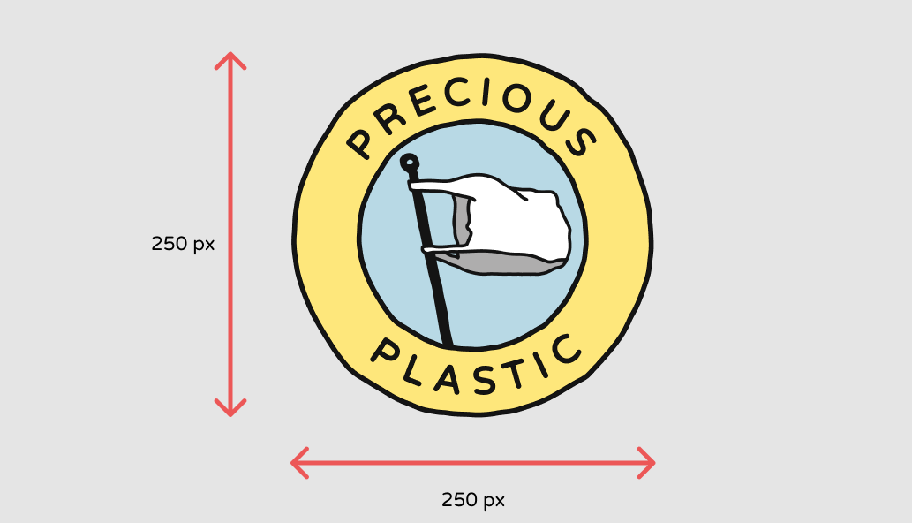
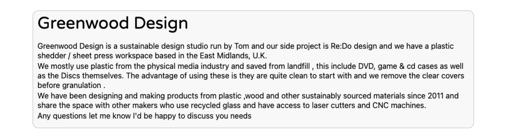

# Make a trustworthy Seller profile

To build and strengthen your business on the Bazar, it's important to have a trustworthy and unique profile.

**Here are some Guidelines on how to create an appealing profile.** 

> Info: Only listings with proper seller profiles will be **promoted on the Bazar homepage**, which will help to increase your visibility and sales.

## 1. Show your logo 

Make sure to make your profile recognisable by uploading a logo to your account. We recommend to use your company logo (if you don’t have any, you can create one with our [logo generator](https://community.preciousplastic.com/academy/universe/yourlogo)).

The recommended size for your logos is **250 x 250 pixels**, and the total size must be under **5 MB**. Image file types allowed are .jpeg and .png

## 2. Describe yourself 

A complete description of your business should state: 

* who you are
* what you stand for (mission/motivation)
* what your companies main activities are
* previous references, etc. 


Any relevant information that will provide detail to the customer on your business and make them **trust in your profile** and feel comfortable to purchase your items.

## 3. Give options to pay

In order to make sales on the Bazar, it is required to set up **at least one payment option** (duh!).

In order to increase your group of potential customers, try to set up both payment options - **Credit Card and Paypal** - to respond to most of the potential needs.

If you need more information on how to set up payment options, please refer to the Guide to [Set up your payment method](https://community.preciousplastic.com/academy/business/Setup_Payment).

##4. Get your reviews 

Reviews from customers reflect the purchase experience and can comment on: the quality of your communication, your item quality, delivery experience etc.

They are publicly visible and can act as your portfolio, which serves as an **indicator for potential customers** to decide to buy or not buy from you.

We therefore strongly recommend you to ensure a **high quality of service** through your exchanges with the customer.

If customers do not leave a review on their own, you can **set your order status to “Awaiting review”** which will notify them with a reminder to write a review.  






#Happy Selling ✌️

Ok, these are the guidelines we believe will **help you perform well on the Bazar**. 

Good luck and feel free to reach directly to us for help or if you think we’ve missed important tips on improving sellers listings. 

You can find us daily on Discord on the [#🙌bazar-seller channel](https://discord.gg/2E93VxB3CD) or can send us an email at **bazar@preciousplastic.com**.

