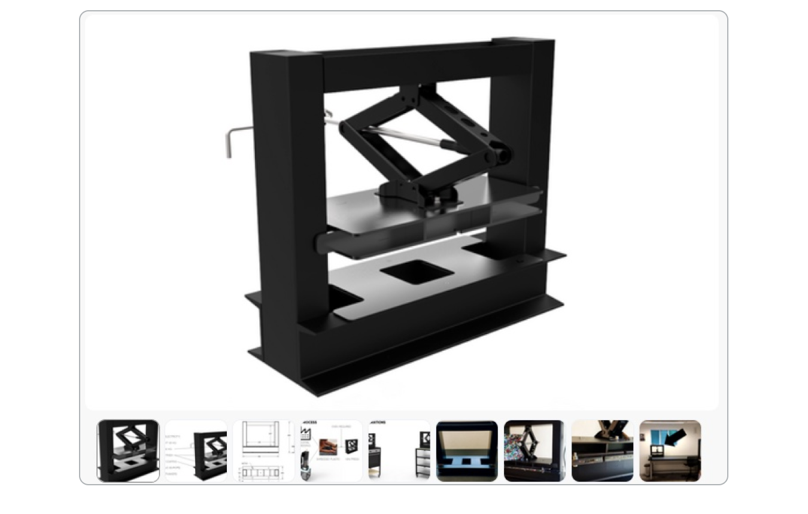
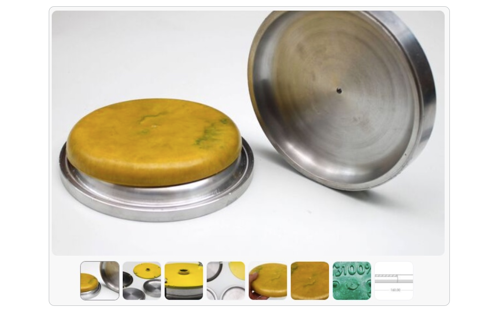
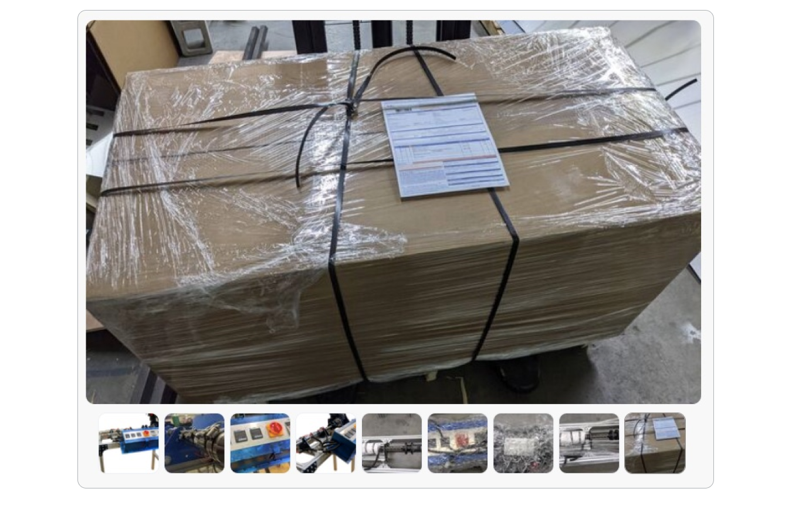
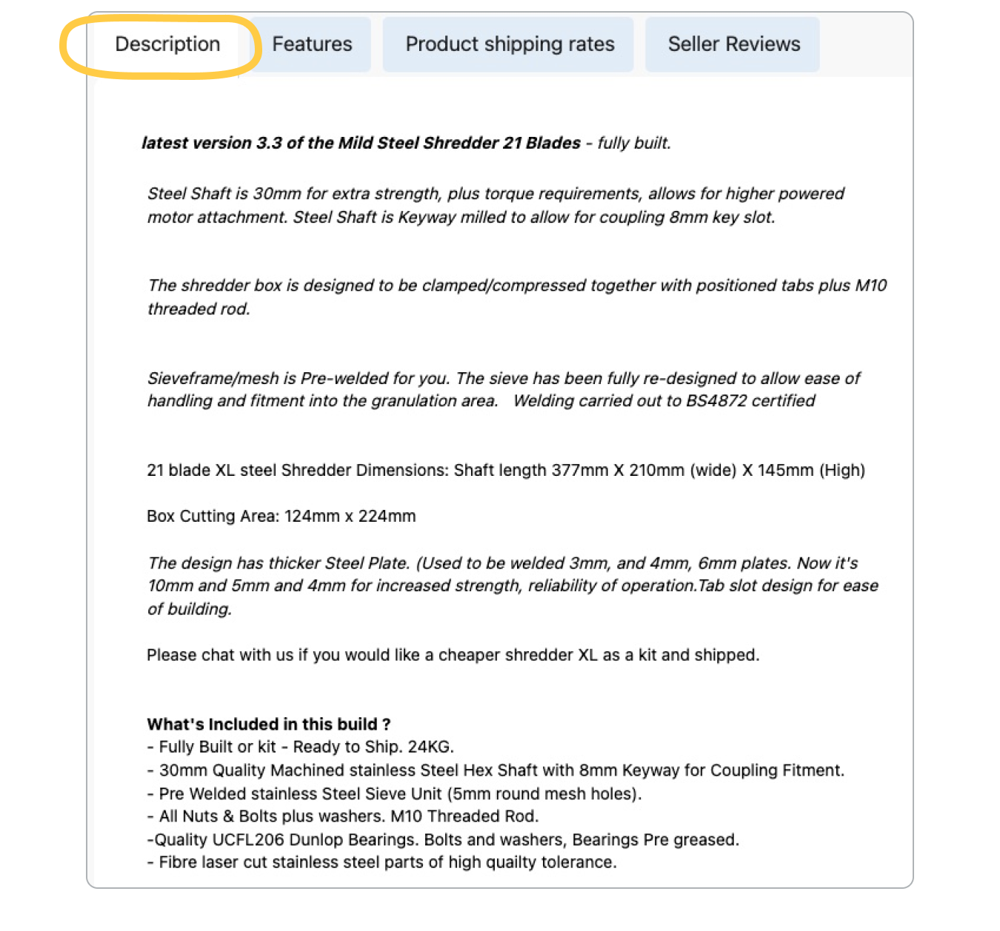
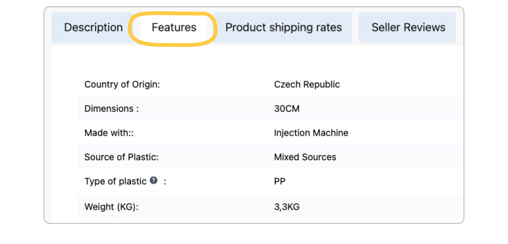
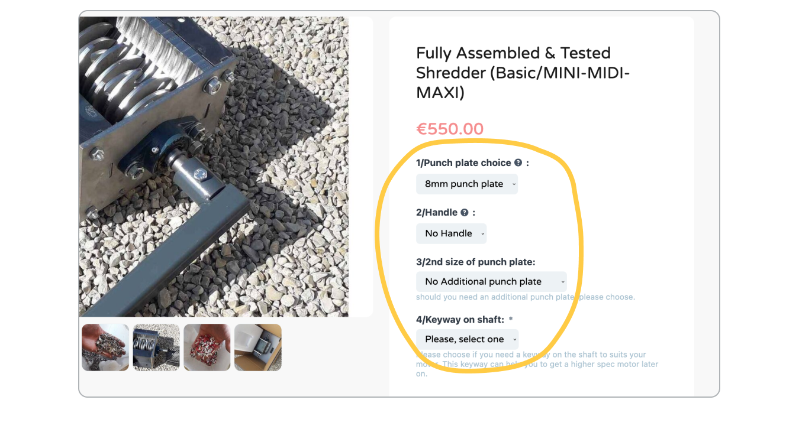

# Create precious listings on the Bazar

Putting some love into your listing will help you to attract customers and make them trust in the quality of your work.
High quality content on the Bazar will also make the overall experience of the Bazar more successful and therefore make the users happier and result in **more traffic and sales for everyone!**

>Good listings also have better chances to be **promoted on the homepage, newsletters and social media**, which will help to increase your visibility and sales.

**Here are some Guidelines on how to create an appealing listing that has higher chances to be sold.** [This video](https://www.loom.com/share/b1df010a31b04a79b034f723b579cc4e) will go over the essential elements to consider, they will also be explained below.

## 1. Item type
Stick to what the Bazar is made for as this is what customers will be looking for: Plastic recycling machines, moulds, raw material and products made from recycled plastic. Offering services is not accepted.

## 2. Title

The title of your item should be as straightforward as possible and include the essential elements of your item. It should not contain too much information but just enough for the customer to know straight away if this is what they are looking for.

## 3. Images

The content and quality of your images is probably one of the most important and powerful aspect to make your listing **informative and convincing**, so we will share some best practices here.

Horizontal (landscape) images are highly encouraged for maximum visibility. The minimum recommended listing image size is **794 x 1000 pixels** with a resolution of 72ppi.

### 3.1 Multiple angles

Include pictures from various angles, and to ensure a **full view** of the item, its components and proportions.

It’s good practice to have both **clean photos** showing only the item itself, as well as at least one photo showing the item **in context** to get a feeling for the size and proportions.

### 3.2 Close ups & wide angles

Close ups as well as wide angles will help to get a feeling of the details and quality of the item.

### 3.3 Shipping box (incl. dimensions)


Especially when buying a machine, it is very useful for the customer to include a picture of the shipping box with dimensions. 

This will help the customer **know what to expect when receiving the item** and if they need special equipment to unload it (e.g.: delivery pallet and need for a forklift). 

It also shows that you have been through this step before and makes you more **trustworthy**.

### 3.4 CAD drawings

If available, it can help to share the CAD or technical drawings of the machine, mould or item.


This can give a better understanding of **exact measurements and assembly**, which can help the customer to assess whether their existing equipment will be compatible with your item.

# 4. Description

As with pictures, having a **clear and detailed item description** will enable the customer to have no doubt on what they are buying, this will also help reduce your customer contact rate. 

The buyer should be able to clearly understand all the key features, dimensions, conditions etc. **- everything they need to know** about what it is they're looking at, so that they can evaluate whether they are going to make a purchase or not.

**Please don't include links to other platforms in your item description**. We accept links to content that explains more about the item and that is not supported on the Bazar, for example a PDF document.

If applicable, you could also include your terms & conditions.

## 5. Features

Completing the features section provided by the Precious Plastic Bazar helps the customer better understand the item he is buying and building trust with your store.

Please make sure you **fill out as many as possible, ideally all**.

## 6. Options

There is a great opportunity to **customise your item for customer needs** (people love that!). Additionally, it helps customers to click and buy, reducing friction and increasing conversion rate.

A few examples:

* A mould might have to fit either to a **screw or tapered** nozzle. 
* A shredder can come with a sieve of **different hole sizes**. 
* An item might be available in **different colour ranges**.

Listings with multiple options generally perform better as customers love to choose **exactly what is suitable** for them.

## 7. Shipping options

The more shipping options you have, the **wider range of customers** you can reach. 

The easiest option to cover shipping options worldwide, is to set up a shipping price for **each of the biggest regions** (USA, South America, Europe, Africa, Russia, Asia, Oceania).

If not set up per region, try to offer shipping for **as many countries as possible**.  We recommend having at the very least shipping options in **Europe and the United States** (as these are the most active user groups on the Bazar).

> The Bazar will only be able to **promote items with Europe and US shipping** enabled, as this is the biggest user group of the Bazar.

Also make sure to pay attention to setting the price for each **additional item** (especially for machines it is very likely that double the quantity means double the shipping price).

You can find more about shipping and regions in our [**Guide to set up your shipping options**](https://community.preciousplastic.com/academy/business/International_Shipping).

# Want to get featured? ✨

Ok, these are the guidelines we believe will **help your listings to perform well on the Bazar**. Good luck!

We love showcasing great work, and support sellers who put love into their work and appearance on the Bazar. If you would like to see your listings featured (for example on the homepage, on email campaigns or social media) make sure to follow our guidelines [**how to get featured**](https://community.preciousplastic.com/academy/business/regions).

## Questions? Feedback?

Feel free to reach directly to us for help or if you think we’ve missed important information and tipps.

You can find us daily on Discord on the [#🛒bazar channel](https://discord.com/channels/586676777334865928/1177318319443939348) or can send us an email at **bazar@preciousplastic.com**.