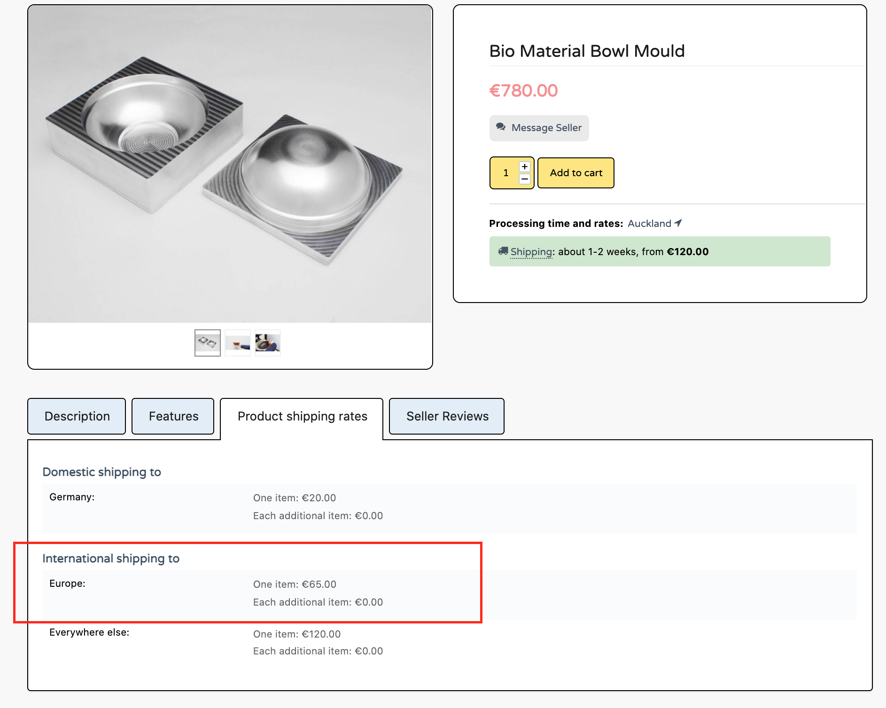

# Add Regions as a Shipping Destination

This article will show you how to apply a shipping rate across a region, which will then apply to all countries located that region. This shortens the process of adding shipping locations for each country. 

## How to set a regions as a shipping destination

After configuring your domestic shipping option, click “Add another shipping location”, select a region, and set your shipping costs as usual. This shipping rate will now apply to all countries within that region. 

## Can I set a different shipping rate for a region and a specific country within that region?

Yes! We understand that shipping costs for different countries in a region may vary. For example, if are located in Vietnam and set a shipping rate of €10 for Asia, €15 for Indonesia, and €20 for Azerbaijan. A customer from Cambodia will get a shipping rate of €10, a customer from Indonesia will get a shipping rate of €15, a customer from Azerbaijan will get a shipping rate of €20, and a customer from Thailand will get a shipping rate of €10.

## What countries are within each region?
🌍 Region | 🏳 Countries |  Countries .
--- | --- | --- 
**Europe** | - Albania   - Andorra   - Armenia   - Austria   - Azerbaijan   - Belarus   - Belgium   - Bosnia and Herzegovina   - Bulgaria   - Croatia   - Cyprus   - Czechia   - Denmark   - Estonia   - Finland   - France   - Georgia   - Germany   - Greece   - Hungary   - Iceland   - Ireland   - Italy   - Kazakhstan   - Kosovo   - Latvia  | - Liechtenstein   - Lithuania   - Luxembourg  - Malta   - Moldova   - Monaco   - Montenegro   - Netherlands   - North Macedonia   - Norway   - Poland   - Portugal   - Romania   - Russia   - San Marino   - Serbia   - Slovakia   - Slovenia   - Spain   - Sweden   - Switzerland   - Turkey   - Ukraine   - United Kingdom   - Vatican City (Holy See)
**North America** | - Antigua and Barbuda   - Bahamas   - Barbados   - Belize   - Canada   - Costa Rica   - Cuba   - Dominica   - Dominican Republic   - El Salvador   - Grenada   - Guatemala   - Haiti   - Honduras   - Jamaica   - Mexico   - Nicaragua   - Panama   - Saint Kitts and Nevis   - Saint Lucia   - Saint Vincent and the Grenadines   - Trinidad and Tobago   - United States of America   | - Anguilla (UK)   - Aruba (Netherlands)   - Bermuda (UK)   - Bonaire (Netherlands)   - British Virgin Islands (UK)   - Cayman Islands (UK)   - Clipperton Island (France)   - Curacao (Netherlands)   - Greenlands (Denmark)   - Guadeloupe (France)   - Martinique (France)   - Montserrat (UK)   - Navassa Island (USA)   - Puerto Rico (USA)   - Saba (Netherlands)   - Saint Barthelemy (France)   - Saint Martin (France)   - Saint Pierre and Miquelon (France)   - Sint Eustatius (Netherlands)   - Sint Maarten (Netherlands)   - Turks and Caicos (UK)   - US Virgin Islands (USA)
**Oceania** | - Australia   - Fiji   - Kiribati  - Marshall Islands   - Micronesia   - Nauru   - New Zealand   - Palau    - Papua New Guinea   - Samoa   - Solomon Islands   - Tonga   - Tuvalu   - Vanuatu  | - American Samoa (USA)   - Cook Islands (New Zealand)   - French Polynesia (France)   - Guam (USA)   - New Caledonia (France)   - Niue (New Zealand)   - Norfolk Island (Australia)   - Northern Mariana Islands (USA)   - Pitcairn Islands (UK)   - Tokelau (New Zealand)   - Wake Island (USA)   - Wallis and Futuna (France)
**Africa** | - Algeria   - Angola   - Benin   - Botswana   - Burkina Faso   - Burundi   - Cabo Verde   - Cameroon   - Chad   - Comoros   - Democratic Republic of the Congo   - Republic of the Congo   - Djibouti   - Egypt   - Equatorial Guinea   - Ethiopia   - Gabon   - Gambia   - Ghana   - Guinea   - Guinea-Bissau   - Ivory Coast   - Kenya   - Lesotho   - Liberia   - Libya   | - Madagascar   - Malawi   - Mali   - Mauritania   - Mauritius   - Morocco   - Mozambique   - Namibia   - Niger   - Nigeria   - Rwanda   - Sao Tome and Principe   - Senegal   - Seychelles   - Sierra Leone   - Somalia   - South Africa   - South Sudan   - Sudan   - Tanzania   - Togo   - Tunisia   - Uganda   - Zambia   - Zimbabwe
**Asia** | - Afghanistan   - Armenia   - Azerbaijan   - Bahrain   - Bangladesh   - Bhutan   - Brunei   - Cambodia   - China   - Cyprus   - Georgia   - India   - Indonesia   - Iran   - Iraq   - Israel   - Japan   - Jordan   - Kazakhstan   - Kuwait   - Kyrgyzstan   - Laos   - Lebanon    - Malaysia   | - Maldives   - Mongolia    - Myanmar (Burma)   - Nepal   - North Korea   - Oman   - Pakistan   - Palestine   - Philippines   - Qatar   - Russia   - Saudi Arabia   - Singapore   - South Korea   - Sri Lanka   - Syria   - Taiwan   - Tajikistan   - Thailand   - Timor-Leste   - Turkey   - Turkmenistan   - United Arab Emirates   - Uzbekistan   - Vietnam   - Yemen
**South America** | - Argentina   - Bolivia   - Brazil   - Chile   - Colombia   - Ecuador   - Guyana   - Paraguay   | - Peru   - Suriname   - Uruguay   - Venezuela   - Falkland Islands (UK)   - French Guinea (France)   - South Georgia and the South Sandwich Islands (UK)

