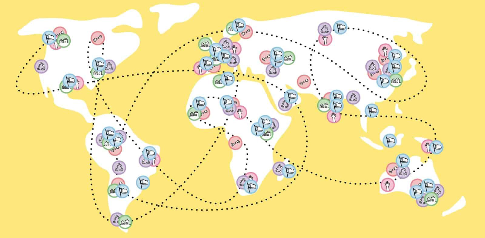
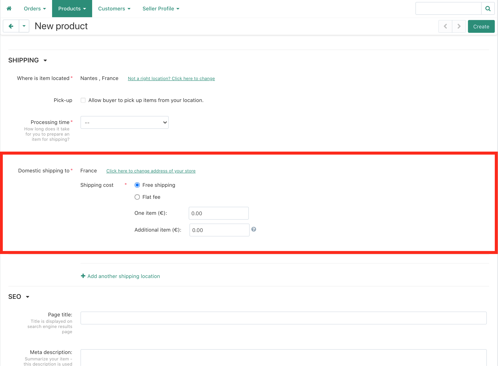
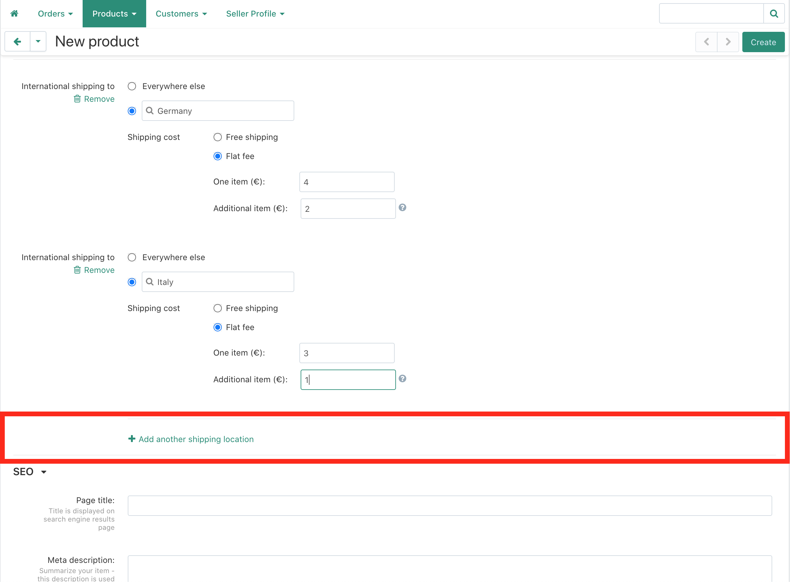
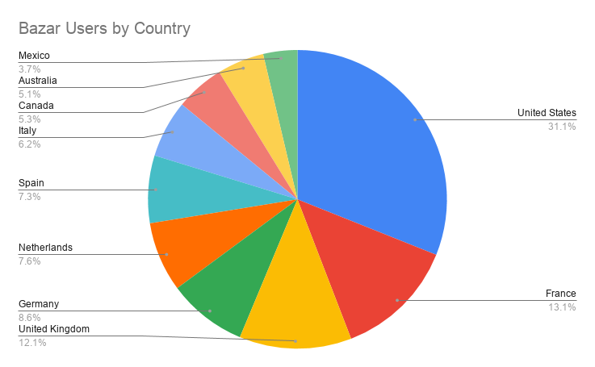

# Set up your Shipping Options

Users from all over the world visit the Bazar on a daily basis. It’s important for you as a seller to have your shipping options set up properly, so your listings are ready to be purchased without any barrier.

> **What if I don't provide shipping options?** Customers of different locations will see that your product is not set up to be shipped to their country. They can write a message to you to request to add their location, but many customers don't do this extra step, so **you can loose your sale**.

Setting this up in the beginning, will create a smoother experience for both sides, and can be of big help to increase your sales on the Bazar.

## 1. Domestic shipping
As a minimum your product needs to have a domestic (your country) shipping price.

There are generally two options to set up a shipping price:

* **Free shipping:** You can calculate the shipping price into your product's standard price, so that no extra costs apply. Easy.
* **Flat fee:** Here you define a shipping price for **one item** and for **additional items**. For smaller items like products, moulds or shredded plastic, the shipping price might not change much with a higher quantity (so it can be free, or smaller than the "one item" price), but for an extra machine, you will probably have to add the same shipping price for each added item.

## 2. Regions

You can also apply a shipping rate across a region, which will apply to all countries located in that region. This way you can quickly set up the shipping rates for many countries.

> Setting up shipping for many regions will widen your audience and customers, but be sure to know what prices and conditions you're dealing with **before**, so you don't run into complications during a transaction with a customer.

The regions show up by default, but if you don't want to offer shipping to all regions, you can remove individual areas manually (and also add them again later if you wish to).

As the shipping rates might vary even within a region, you can also add a different shipping rate for specific countries *(more about this in the next point)*.

## 3. Specific countries

Even though the shipping prices to countries within a region are often relatively similar to each other, the prices can vary from one country to another.

To make sure you are not charging too much for the customer, or loosing money on shipping, you can also set up individual prices for specific countries.s

> The more countries you have set up, the more accurate and fair (for both sides) you can have your shipping rates. On the other hand, it also takes more effort to set up and keep updated. That's why setting it up per region can be helpful.

### Can I set a different shipping price for a region and a specific country within that region?

Yes! You can set up a price that is suitable for most of the countries in a region and then you can add prices for specific countries, that have a very different price.

### Make sure to add the Bazar’s largest markets
Not all locations are equal in impact. There are certain countries where many of the Bazar users are located. Make sure to add shipping options for these locations in order to increase the likelihood of a sale.

## What countries are within each region?
🌍 Region | 🏳 Countries |  Countries .
--- | --- | ---
**Europe** | - Albania   - Andorra   - Armenia   - Austria   - Azerbaijan   - Belarus   - Belgium   - Bosnia and Herzegovina   - Bulgaria   - Croatia   - Cyprus   - Czechia   - Denmark   - Estonia   - Finland   - France   - Georgia   - Germany   - Greece   - Hungary   - Iceland   - Ireland   - Italy   - Kazakhstan   - Kosovo   - Latvia  | - Liechtenstein   - Lithuania   - Luxembourg  - Malta   - Moldova   - Monaco   - Montenegro   - Netherlands   - North Macedonia   - Norway   - Poland   - Portugal   - Romania   - Russia   - San Marino   - Serbia   - Slovakia   - Slovenia   - Spain   - Sweden   - Switzerland   - Turkey   - Ukraine   - United Kingdom   - Vatican City (Holy See)
**North America** | - Antigua and Barbuda   - Bahamas   - Barbados   - Belize   - Canada   - Costa Rica   - Cuba   - Dominica   - Dominican Republic   - El Salvador   - Grenada   - Guatemala   - Haiti   - Honduras   - Jamaica   - Mexico   - Nicaragua   - Panama   - Saint Kitts and Nevis   - Saint Lucia   - Saint Vincent and the Grenadines   - Trinidad and Tobago   - United States of America   | - Anguilla (UK)   - Aruba (Netherlands)   - Bermuda (UK)   - Bonaire (Netherlands)   - British Virgin Islands (UK)   - Cayman Islands (UK)   - Clipperton Island (France)   - Curacao (Netherlands)   - Greenlands (Denmark)   - Guadeloupe (France)   - Martinique (France)   - Montserrat (UK)   - Navassa Island (USA)   - Puerto Rico (USA)   - Saba (Netherlands)   - Saint Barthelemy (France)   - Saint Martin (France)   - Saint Pierre and Miquelon (France)   - Sint Eustatius (Netherlands)   - Sint Maarten (Netherlands)   - Turks and Caicos (UK)   - US Virgin Islands (USA)
**Oceania** | - Australia   - Fiji   - Kiribati  - Marshall Islands   - Micronesia   - Nauru   - New Zealand   - Palau    - Papua New Guinea   - Samoa   - Solomon Islands   - Tonga   - Tuvalu   - Vanuatu  | - American Samoa (USA)   - Cook Islands (New Zealand)   - French Polynesia (France)   - Guam (USA)   - New Caledonia (France)   - Niue (New Zealand)   - Norfolk Island (Australia)   - Northern Mariana Islands (USA)   - Pitcairn Islands (UK)   - Tokelau (New Zealand)   - Wake Island (USA)   - Wallis and Futuna (France)
**Africa** | - Algeria   - Angola   - Benin   - Botswana   - Burkina Faso   - Burundi   - Cabo Verde   - Cameroon   - Chad   - Comoros   - Democratic Republic of the Congo   - Republic of the Congo   - Djibouti   - Egypt   - Equatorial Guinea   - Ethiopia   - Gabon   - Gambia   - Ghana   - Guinea   - Guinea-Bissau   - Ivory Coast   - Kenya   - Lesotho   - Liberia   - Libya   | - Madagascar   - Malawi   - Mali   - Mauritania   - Mauritius   - Morocco   - Mozambique   - Namibia   - Niger   - Nigeria   - Rwanda   - Sao Tome and Principe   - Senegal   - Seychelles   - Sierra Leone   - Somalia   - South Africa   - South Sudan   - Sudan   - Tanzania   - Togo   - Tunisia   - Uganda   - Zambia   - Zimbabwe
**Asia** | - Afghanistan   - Armenia   - Azerbaijan   - Bahrain   - Bangladesh   - Bhutan   - Brunei   - Cambodia   - China   - Cyprus   - Georgia   - India   - Indonesia   - Iran   - Iraq   - Israel   - Japan   - Jordan   - Kazakhstan   - Kuwait   - Kyrgyzstan   - Laos   - Lebanon    - Malaysia   | - Maldives   - Mongolia    - Myanmar (Burma)   - Nepal   - North Korea   - Oman   - Pakistan   - Palestine   - Philippines   - Qatar   - Russia   - Saudi Arabia   - Singapore   - South Korea   - Sri Lanka   - Syria   - Taiwan   - Tajikistan   - Thailand   - Timor-Leste   - Turkey   - Turkmenistan   - United Arab Emirates   - Uzbekistan   - Vietnam   - Yemen
**South America** | - Argentina   - Bolivia   - Brazil   - Chile   - Colombia   - Ecuador   - Guyana   - Paraguay   | - Peru   - Suriname   - Uruguay   - Venezuela   - Falkland Islands (UK)   - French Guinea (France)   - South Georgia and the South Sandwich Islands (UK)

## Questions? Feedback?

Feel free to reach directly to us for help or if you think we’ve missed important information and tipps.

You can find us daily on Discord on the [#🙌bazar-seller channel](https://discord.gg/2E93VxB3CD) or can send us an email to **bazar@preciousplastic.com**.
