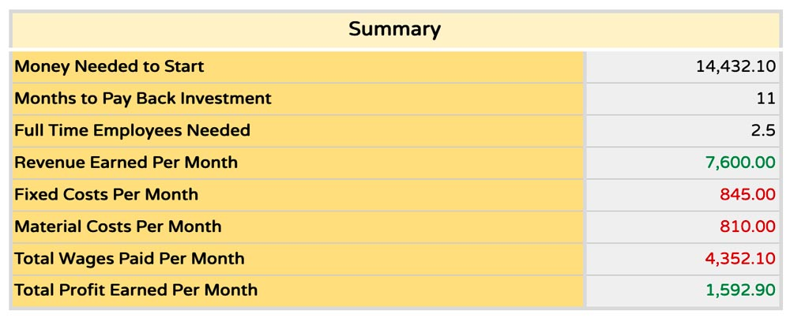

  <iframe width="800" height="400" src="https://www.youtube.com/embed/NpEaa2P7qZI" frameborder="0" allow="accelerometer; autoplay; encrypted-media; gyroscope; picture-in-picture" allowfullscreen></iframe>

# Workspace Calculator 

### Title

The Workspace Calculator is a financial forecasting tool for you to understand the financial feasibility of starting a workspace. This tool isn’t an exact science, but gives you a starting point for how much money you need to start, how many products and services you need to sell per month in order to be profitable, and how long it’s going to take to pay back your initial investment. 

> Tip: this is a great tip

Let's jump in!

### Video Chapters

- 00.08 What is it?
- 02.00 Start
- 03.13 Sales
- 04.48 Costs
- 07.53 Dashboard
- 13.03 Extras

(gif mousing around the calculator)</i>

### To get the best out of this tool: 

- Start on the “Read Me” page and then move from left to right. This will provide the best workflow and results
- Don’t worry about having the exact numbers - even a ballpark will give you a good idea
- Only fill in the boxes surrounded by a blue border
- The numbers you input can be less than 1 - simply use a decimal place (Example - 0.57)
- Reach out to existing workspaces that are doing something similar (either by using the map or Discord), they might be able to share some of the numbers you need

### Key Terms

<b>Revenue:</b> Money you bring in from selling a product or service 

<b>Profit:</b> Money you will still have after paying for all the costs (rent, materials, electricity etc) 

<b>Profit Margin:</b> The percentage of profit you’re earning above the total cost 

<b>Investment:</b> A one time cost you pay for an asset: a machine, tool etc  

<b>Fixed Costs:</b> Costs that you pay monthly, quarterly, or yearly that don’t depend on the amount of products and services that you produce - rent for example 

<b>Variable Costs:</b> Costs that depend on the number or products and services that you produce - materials for example 

<b>Cash Flow Statement:</b> An overview of how you spent money throughout the year 

<b>Profit and Loss Statement:</b> An overview of how much money you made or lost

## 0. READ ME

The Read Me sheet tells you all you need to know about using the workspace calculator. The two most important things to know are that you only fill in the cells that are in blue, and that if hover over cells with an arrow in the top right corner, you can find more information about what we’re asking you about. 

## 1. SALES 

This is about what products you’re going to produce and how much time and resources it will take to produce them. You onlined these on your Action Plan - now it’s time to forecast some costs. Every product or service costs something to produce, whether it’s the plastic that is going into a beam, or the time you spend preparing for a workshop. 

<b>Products or Services:</b> here you can list all the products, machines, workshops or services that you plan on selling with your Precious Plastic workspace. You can be a specific as you want here - if you plan on selling different bowls at different prices, you might want to list each type or color separately.  

<b>Material Cost for Each Product:</b> estimate how much each product or service would cost you in materials. This can be difficult, as you don’t have exact numbers for this, but try your best to “guesstimate”. For example, if you know how much it cost to source your plastic per kilo, estimate the weight of the product you’re planning producing and then multiply that by the price per kilo. 

<b>Hours to produce:</b> estimate the time it will take to create each product or service. For example, you could use the production output rates given for each machine. 

## 2. COSTS

The cost sheet is where you input your weekly activities, investments, and monthly costs. These include all the costs you have besides the direct investment into your products and services. 

<b>Working hours:</b> includes all the activities you will do on a weekly basis to run your business that isn’t directly related to the production of your products. Things like marketing, cleaning your space, talking to the accountant - you know, the fun stuff 🙂

> TIP: Don’t know what to put? Try getting in touch with an existing workspace and ask them how they spend their time during the week. 

<b>Investment costs:</b> here you can input the one time costs that you need to start your workspace. These are things like the Precious Plastic machines, certain tools you’ll need, or the cost to renovate a space you have in mind. Try to limit yourself to the bare minimum investments you need to get started - it’s better to start small and focused, and then make additional investment after you start to be profitable or making significant amounts of income. 

<b>Fixed costs:</b> here you input all of the costs that do not vary with the amount of products and services that you produce, but you have to pay on a regular basis. These are things like rent and utilities for your workspace, website hosting or accounting software subscription. Some costs may need to be paid quarterly or yearly, so do some quick calculations to estimate them on a monthly basis for this part. Another good thing to ask an existing workspace about - what are their main recurring monthly costs? 

## 3. DASHBOARD

The dashboard is where everything starts to come together and you can see the whole financial picture of starting your workspace. Exciting! It’s also where you can play around with a few of the main variables to see how it affects the final output - like the number of employees, time to pay back your initial investment, and total profit earned per month. 

Things to consider: 

- Check around to see what people are selling similar products and services for in different sales channels (online, in-store, etc)
- Conservatively estimate the number of sales you think you can achieve on a monthly basis. This will change as your business grows, but pick some numbers that are achievable over the next year.
- When inputting the hourly wage amount, consider all activities across your business by you or your co-owners and employees - production, marketing, accounting.

### Dashboard - Profit Margin

Now for some numbers to get excited about! As you complete the variables you can start to analyze the results. The first thing to consider is the profit margin per product - these numbers should all be green, meaning that the price you’re charging is covering the costs of producing these products and services, with some extra. 

If the profit margin is red, you’ll need to change some of the variables. If you feel like you can’t raise the price anymore and still have people purchasing, try lowering your hourly wage and analyze the effect on the profit margin. Perhaps you overestimated the material costs or hours to produce this product or service. If you can’t find a price or amount of sales that gives you a positive profit margin (in the green), then you should think about not producing this product or service. Even if you think it’s a good product or service, sometimes it’s simply not feasible for customers to pay what it costs to cover the costs of production. 

Many people wonder about what profit margin should be the target for each item, but unfortunately there isn’t a straightforward answer to that question. It really is a balancing act between having a good profit margin, while still being able to sell a reasonable amount of this product or service. Some products may have a profit margin of several hundred percentage points.

### Dashboard - Summary Box

Once you’ve worked out a good profit margin for each one of your products and services, now start analyzing the summary box results: 

<b>Money needed to start:</b> comes from adding all of your investment costs, plus one month of operational costs (material costs, labor costs, and fixed costs). One month of operational costs is included so that you have enough money to pay the monthly costs in the beginning of your operational costs. If your “money needed to start” seems high to you, perhaps you can try to limit even more what investment cost you really need to get started. It might even help you focus on only the truly crucial elements to begin delivering to customers. 

<b>Months needed to payback investment:</b> gives you an idea about how long it will take for you to recoup the investment of getting started, no matter if it was a loan, your own money, or money you borrowed from a bank. It works by assuming that the profit earned each month is used to payback this initial investment you made to start. This doesn’t take into account any payment terms like a payment schedule or interest rate you might work out with a bank or other financial entity, it simply helps you think about the profitability of this business relative to the initial investment you need to get it started. For example, you might have to invest what seems like A LOT of money, but it could be paid back in a relatively short period of time. On the other hand, if it will take you longer than 36 months (3 years) to pay back the initial investment, the cell will show “Too Long!”, to tell you that this is not a reasonable amount of time to payback an initial investment and you should revise your variables to be more profitable. 

<b>Full time employees:</b> tells you about how many people you need to have working on this business to cover all the work needed to be done. For example, if the cell says 2.5, that means you need two full time employees working 40 hours per week, and 1 employee working 20 hours per week. 

<b>Revenue earned per month:</b> is the amount of money earned from the sales of all products and services that you produce.

<b>Fixed cost per month</b> is the sum of all the monthly fixed costs that you inputted on the costs page. 

<b>Material costs per month</b> is all the material costs of producing all of the products and services each month. 

<b>Total wages per month</b> are all of the labor costs that will have to pay in one month to all of your employees for producing products and services, as well as performing the weekly activities. 

<b>Total profit earned per month</b> is the total amount of money you earned after you’ve subtracted you material costs, fixed costs, and monthly costs. 

### Dashboard - Charts

The payback analysis chart shows you how long it will take to payback your initial investment. It shows visually what the “months needed to payback initial investment” cell says in the summary table. The month that you have fully paid back your initial investment is when the line turns from red to green 🎉

From the per product revenue versus costs graph you can see how each product stacks up in terms of the money it’s bringing in, versus the money it costs to produce. You can also see how these costs are broken down by material cost, labor cost, indirect labor cost, and overhead cost. The indirect labor cost comes from the weekly activities needed to sustain the business, which are allocated to each product based on the number of units produced. 

The total monthly profit per month shows you how each product and service contributes to your total profit. This graph can help you decide which products and services that you should be focusing on - the ones that bring in a larger share of the profits. 

Total revenue versus costs shows a final overview of how your revenue stacks up against the total costs of the business. 

## Extras 

The extra’s page provides you with some basic financial statements (like cashflow and profit & loss) and shows you the calculations from the previous pages. The information could be especially useful for people applying for a bank loan or grant to show a final overview of financial health. 

The <b>cashflow statement</b> is a projection for the first year of operations based on the revenue and cost estimations you provide. A projected cashflow statement shows that you have enough cash on hand to pay all of the necessary costs from month to month. At the end of the first year, you can generate a cash flow statement based on your real costs and revenues. 

A <b>profit and loss statement</b> is an overview of the financial health of an organisation. The projected profit and loss statement shows if you will have made a positive net profit at the end of the year.

The <b>monthly sales figure</b> shows the full breakdown of the costs for each of your products and services. 

The <b>payback table</b> shows how the money that you need to start gets “paid back” over time as you start to earn a profit. 

## Big Assumptions

The problem with designing a business tool to be applicable all across the world is that you need to make assumptions to simplify things. Some things to consider:

- It’s possible that if your Precious Plastic business is very focused on production of products and uses one of the bigger version 4 machines, that electricity will have a big effect on the cost of each product. In the example of the workspace calculator electricity is assumed to be a fixed cost, but in this case it’s more like a variable cost that could be included in the material costs section. 
- The hourly wage you input is assumed to be the same for all people working on your business. Perhaps the owner of the workspace wouldn’t pay themselves a wage, but just keep all the profits from the business. People also employed by the business in reality might also be paid different amounts. 
- In the calculation for the “months needed to pay back investment”, all of the profit from each month is assumed to be used to pay back the money needed to start. In reality you might keep more of this extra profit along the way to make additional investments like new machines, tools, etc along the way. 
- This calculator doesn’t include taxes, so be sure to keep that in mind when you are analyzing the results, especially your total profit earned per month and year. You might also have to pay taxes on paying wages, which can significantly increase the cost of the “hourly wage” you pay employees. 
- The “money needed to start” also includes one month of operational costs, but if you want to be conservative, you might want something more like 3-6 months of operational costs available when you start.
- “Full time employees needed” assumes a 40 hour work week, but this might be more or less depending on the work culture of your area. 

### Do you have any thoughts or feedback? Head to our business channels on Discord and share!

