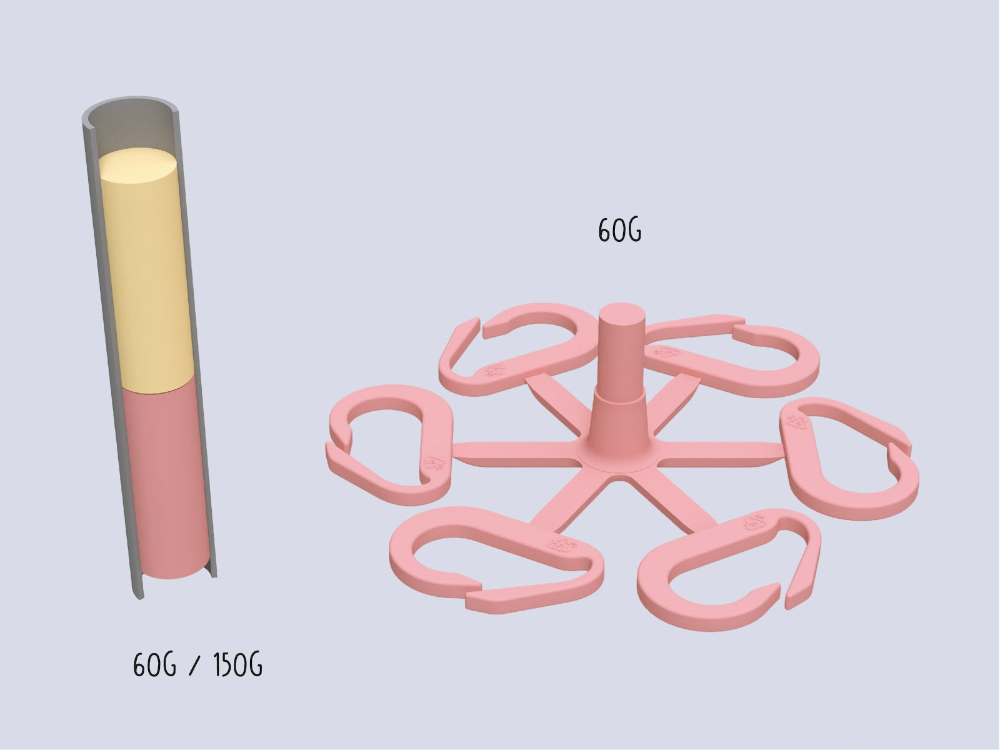
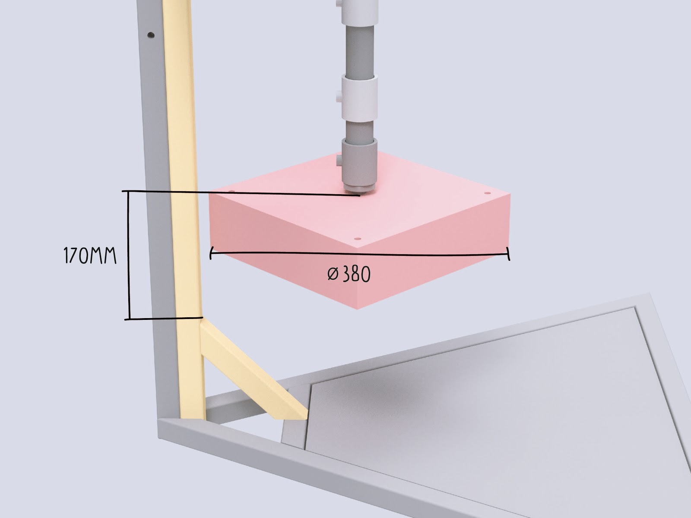
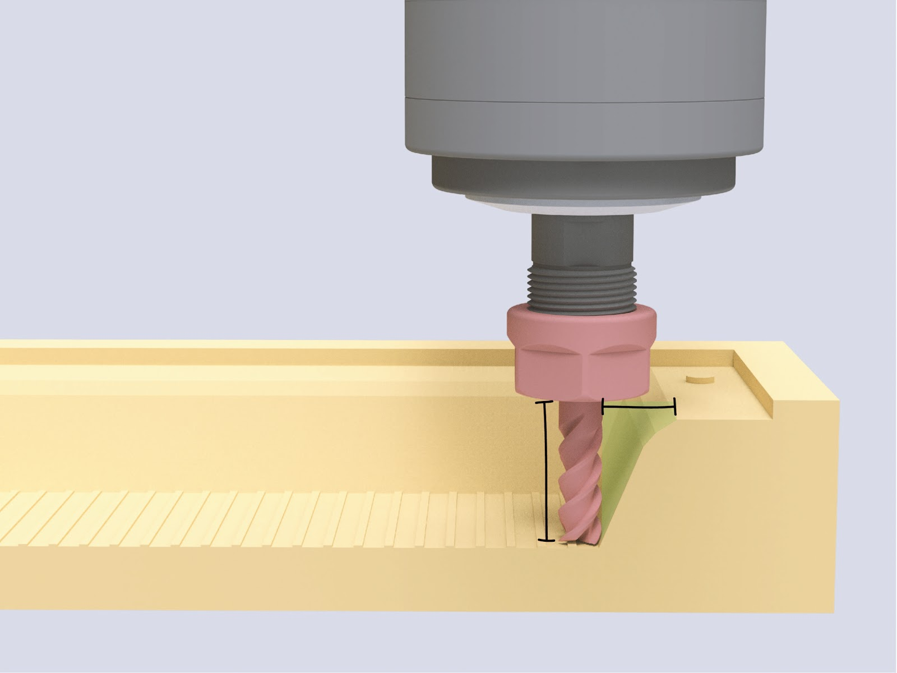
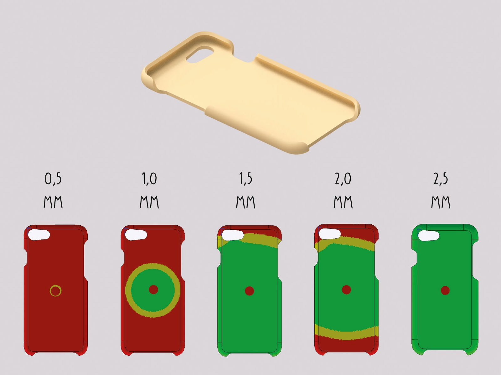
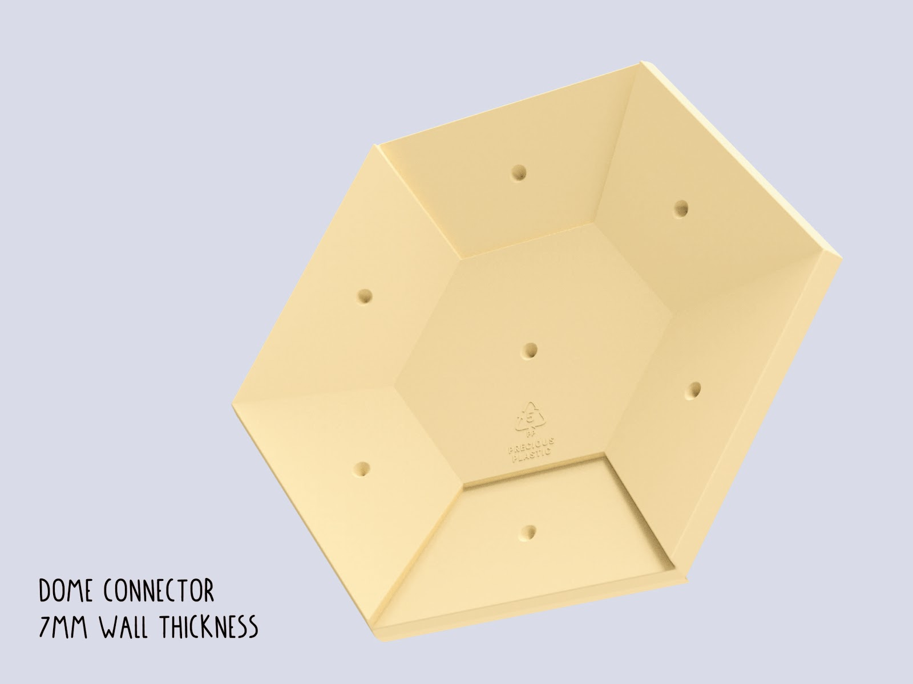
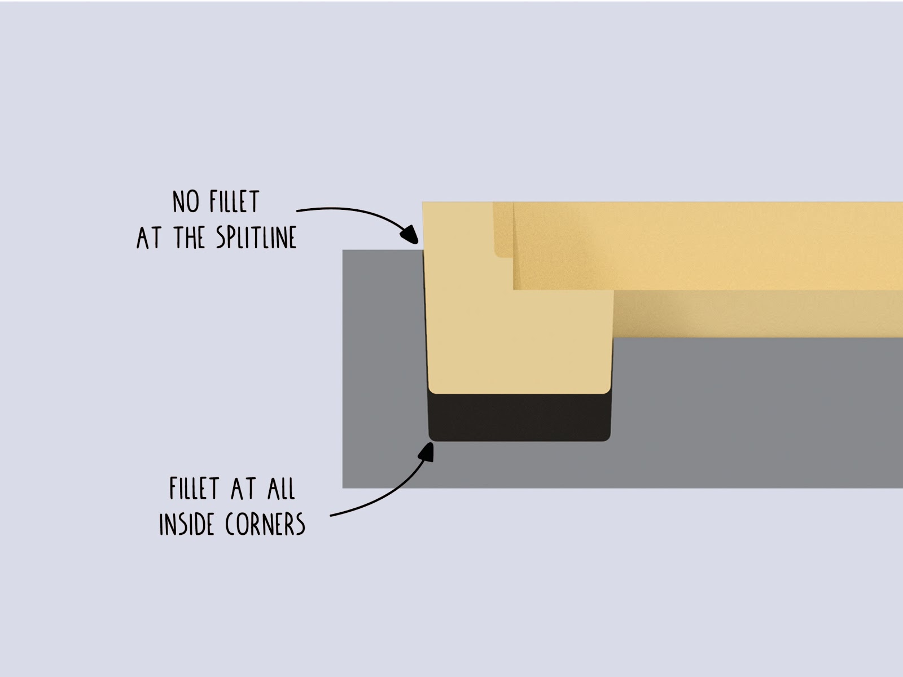
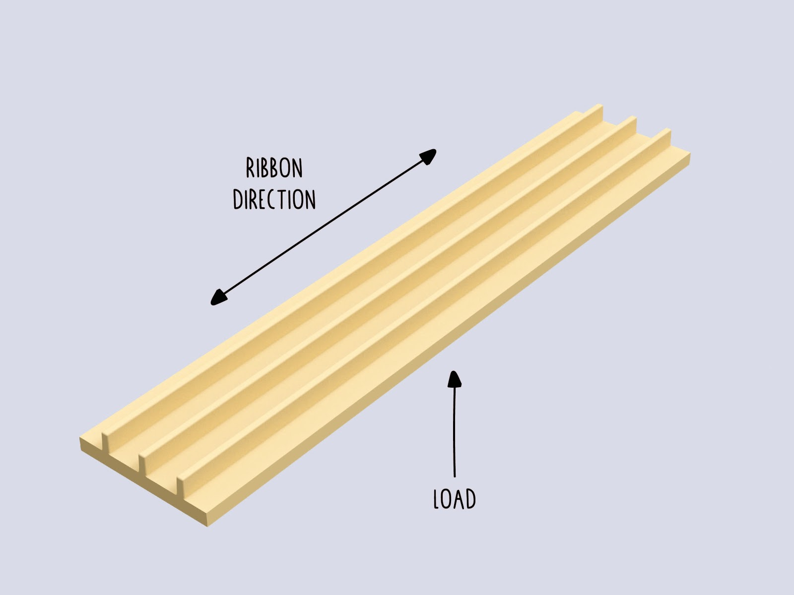
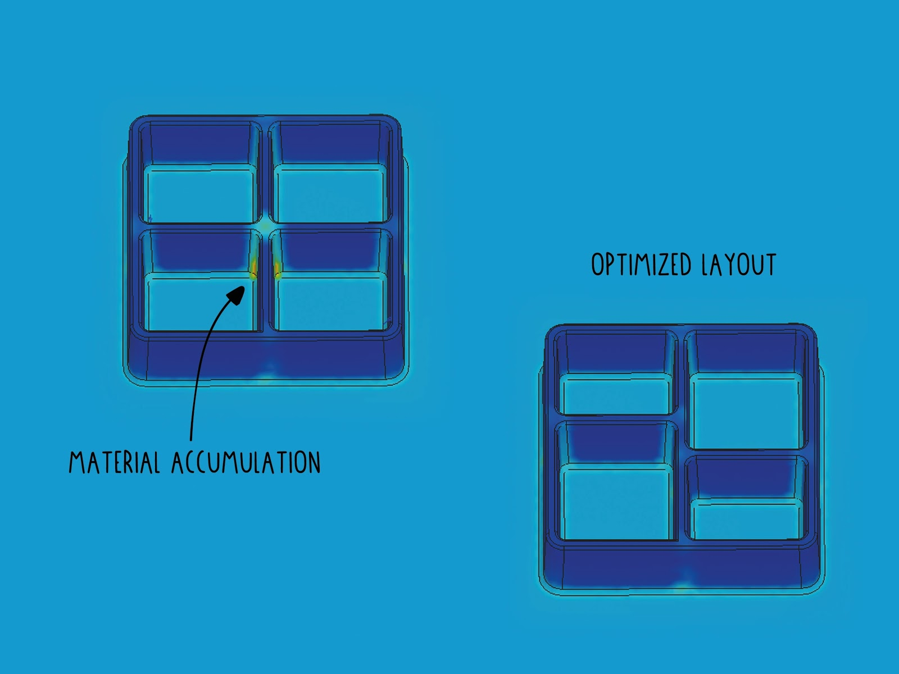

# Tips on making injection moulds

Basically all machines require moulds to make something. Where its a sheet/beam or product. But the injecton machine is the most versatile when it comes to making moulds. Its capable of making very detailed products and there are many different materials you can use. More on that below. But the injection machine also has limits, the size of the object. So before we start, here an overview of the pro's and con's

| Pro    |     Cons   |
|----------|-------------|
| Ideal for small volume parts <150cm³ |  Moulds can be expensive |
| Short cycle times (<2-5min) |   Complicated process with many uncertainties   |
| Multiple cavities enable faster production |     Volume not enough for bigger parts   |
| Reliable production of parts   |   Parts with thin walls need more pressure than the current machine can offer   |
| Very detailed parts can be achieved | Mainly suited for HDPE and PP	|
| Advanced parts can be designed by the use of inlays and sliders|	|

## Materials to make a mould

Ok. you are still here. good. The most common material for small series is aluminium, due it is easier to machine than steel at a relative high lifetime compared to other materials. There are also different manufacturing processes which can be selected for the manufacturing of a mould. Each comes with certain advantages and disadvantages. Here an overview:

| Material    |     Application   | Accuracy | Accessibility | Costs | Lifetime (shots) |
|----------|-------------|-----|-----|-----|-----|
| Wood/ MDF| Not recommended (plastic sticks to the mould) |Low- Medium|High|Low (<100€)|-|
| Acryl (CNC/ Lasercut) |   Demonstrations/prototyping   |Low- Medium|High|Low (<100€)|5-10|
| Silicone Casting |     Prototyping  |Low|High|Low (<100€)|Up to 20|
| SLA Printing (High Temp resin)   |   Prototyping, Small Series   |Medium| Medium |Medium (>200€)|Up to 100|
| [Aluminium (Casting)](https://youtu.be/5LhHUBz9uL0)  |	Moulds for organic Geometry  |Low - Medium|High|Low (<100€)|Up to 2000 - 10.000|
| [Aluminium (Machined)]( https://youtu.be/ZYFoWP-3MYE)   | Small Series, Medium Series	|High|Low|Medium (>200€)|Up to 2000 - 10.000|
| [Steel (2D Lasercut)](https://youtu.be/P_zCIXsHkVI )  | Prototyping - Big Series	|Medium (Lasercut)|Medium|Low (<100€)|Up to 100.000|
| [Steel (Welded)](https://youtu.be/dYG7qcGp5mc )    | Prototyping - Big Series	|Low- Medium|High|Low (<100€)|Up to 100.000|
| Steel (Machined)    |Big Series|Very High|low|High (>1.000€)|Up to 100.000|

# Part and Mould Dimensions

The maximum possible part size is defined by multiple variables:

1. Maximum volume -> is the part volume (inclusive sprue, gates and runners) less than 150g? (for the standard v3 injection machine). Going towards the upper end of the volume range >130g will make additional compressing of the plastic necessary and reduce the cycle time. The granule has a bigger volume than the molten volume of the plastic. See image below

2. Total Size of the mould -> can it be used with my injection machine?
(v3 Injection: Diameter: 380mm x 170mm) If you use a screw nozzle and a rectangular mould consider the diagonal distance for the maximum width/length! See image below

3. Depth of part -> Easiest if less than ~40mm, because standard endmills can be used for the machining. Most Endmills are limited to around 100mm length. Can be relevant if hobby style CNC machines with little Z-Travel are used. The mould can be usually machined from a single block if you stay below 80mm. This can be a big cost saver in the process. See image below

4. Projected area of all cavities, runners and gates towards the opening direction of the mould. This determines the necessary clamping force. This is not an issue for part designs injected with manual injection machines. If your part is manufactured on a higher pressure injection machine you might need to consider this closer. See image below

## Mould Design tip
> Thinking about the manufacturing restrictions early on in the process will save you time and money down the road of bringing your product to life. To reduce the costs for mould making you should design all features as big and as shallow as possible. It allows for the use of bigger tools and faster speeds in the manufacturing of the mould.

## Shrinkage and Tolerancing
All thermoplastic polymers have shrinkage when they cool down from a molten state (see table below).

The shrinkage rate is also relevant for the material and mould planning. The material usually shrinks towards the center of a part. This means that any cutouts or high features in the center can result in a part which gets stuck in the mould.

Especially for fine features where tolerances to match other parts are relevant the consideration of the shrinkage is relevant. The shrinkage can vary also within the given range based on (unknown) additives inside the material.

| Material    |     Shrinkage Rate   |
|----------|-------------|
| HDPE |  3,3% |
| LDPE |   3,8%   |
| PP |     2,6%   |
| ABS, PC, PMMA   |   0,6%   |
| PS | 0,5%	|

## Draft Angle
To eject parts from moulds easily all surfaces parallel to the opening direction need a draft angle. This enables easy unmoulding of the part.

Common value to start is 2°. High features can use a draft angle up to 5°. It is recommended to add 1° draft angle every 25mm of feature height. As more draft angle, as better it is for ejecting a part from the mould. Adding draft angles to a part is not a “natural” consideration and is often conflicting with design goals from mechanical engineering or industrial design. So the goal is to include as much as possible, while still match design and engineering goals. Even a draft angle of 0,5° can make a big difference in the production.

If you add Texture to your surfaces take care to increase the draft angle to 3-5°.

Many software packages on the market offer a helpful draft analysis function. This can be handy especially if you have to check many surfaces on a single part for draft angle. You can set the range of legible draft angles. See figure 3

If there is no possibility of adding a draft angle to your design, consider to work with sliders or inserts to make straight surfaces possible. Keep in mind that this will significantly increase the manufacturing costs.

## Wall Thickness
The right wall thickness is very important for the successful injection of your part during manufacturing. The wall thickness corresponds with the material selection or more accurate with the so called MFI (melt flow index). So according to your material there is a range of possible wall thicknesses. (see Table below)

Be aware that manual injection machines are mainly limited by the pressure they can build up. Select a value at the upper end of the range to ensure that the part can be successful injected. A proven wall thickness is above 2,5mm which in most applications worked well.
In the image you see the iPhone 7 case from the last starter kit. It shows a simulation of multiple wall thicknesses and shows the reason why it became 2,5mm thick.

The maximum values are recommended values from the industry. Keep in mind that it is a valid option to exceed them as far as you want. This can be an option to inject solid parts like a knife handle, small plates or other objects. The disadvantage is that you will face bigger sink marks, higher shrinkage and a longer cycle time because the parts have to cool longer before they can be removed from the mould.

The wall thickness in combination with the flow distance (the gate to the farthest cavity space) is the most important factor in part design to determine the necessary injection force.
In comparison to the industry most workspaces with manual injection machines do not have the option to increase the injection pressure by switching the injection machine. So be very careful about the design of thin walled parts (<1,5mm) and maybe ask for feedback from your mould supplier if the necessary injection force is sufficient to fill your mould.

The wall thickness should be the same all over the part for several reasons:
- Undisturbed flow within the part
- Prevention of sink marks

Reasons to increase the wall thickness:
- Necessary pressure reduced
- Structural strength added
- (Part Geometry needs to be solid)

Reasons to decrease the wall thickness:
- Prevent sink marks
- Reduce material use (necessary injection volume)
- Reduce Cycle Time

| Material    |   Full Range - industrial (mm)   | Manual Machines - recommended (mm) |
|----------|-------------|------------|
| PP |        0,8 - 3,8 | 2,5 - 5 |
| HDPE/LDPE |   0,8 - 4  | 2,5 - 5 |
| PS |     1 - 4   | 2,5 - 5 |
| ABS/PC   |   1,2 - 3,5  | 2,5 - 4,5  |
| POM | 0,8 - 3	| 2,5 - 4 |
| PMMA | 0,6 - 3,8|  2,5 - 5 |

## Fillets
All plastic parts around you have fillets on their edges. The only exception are the edges which are formed at the intersection of the mould halfs or those formed by sliders and inserts in combination with other parts. This enables on the on hand an easy release of the part and on the other a uniform material flow within the mould. Additionally it reduces the costs of mould making in the manufacturing process. Try to keep the minimum inside fillets bigger than 0,5mm to make sure standard tools can be used for manufacturing.

Keep in mind that the wall thickness should be maintained on the fillet as well.

To ensure an easy material flow, try to avoid hard breaks in the part design.

## Text and Graphics
With engraving you can add text and graphics to your product in a very economic way. This avoids post processes like stamping, printing and makes the use of additional labels unnecessary. Especially the plastic type can be added in a very detailed manner.

Text and graphic can be integrated in two ways, either embossed or debossed
Debossed text is the more economic option because the material around the text does not need to be removed by a small endmill.
Although embossed is easier to read, because the area gets darker from the shadows which cast inside.

The most relevant value is the ratio of minimal line width to depth. You see in figure X how the shape of an engraving bit looks like. Due the geometric shape the line with gets wider as deeper the cut becomes. There are engraving bits in a range of 10° up to 90°. The advantage is that you already get a draft angle by default. On smaller font heights the draft angle is barely visible.

The depth for engraved text and graphics should be bigger than >0,2 to 0,5mm. Deeper features can be machined with small endmills. Due basic machines can only use endmills of bigger size ~>0,5mm the line width has to be matched accordingly.

All engraving bits have a flat or round tip and the smallest tip size starts from 0,1mm.

## Holes and Cutouts
Integrated holes or cutouts in injection parts save you time in post processing your parts with secondary operations.

But they come with the risk of creating weld/knit lines when the plastic flows around them and cools down on the way. Those knit lines can add structural weakness at their location. Therefore it is important to know if there is any load applied to the area behind them where the plastic merges.

The same effect will occur if you work with multiple injection gates.

If the applied forces to this area are critical you can also consider post processing methods like Drilling, Laser cutting, CNC milling or die cutting. However this adds another process step and will increase the manufacturing costs.

## Ribs
To increase the structural strength, while maintaining the same wall thickness ribs can be added to increase the rigidity of a part. This can be a time consuming design process, but prevents (opposed to increasing the wall thickness) sink marks in a better way and reduces the used material.

The thickness of the ribs should be around factor 0,4-0,6x wall thickness of the part. Stay on the lower end to prevent sink marks.
The height of the surface ribs should be less than factor 3x wall thickness.

If you design the ribs, make sure to consider the direction of the applied forces - especially for long parts.

To prevent sink marks on aesthetic relevant surfaces, the ribbon structure can be offset at the intersection points, where more material is present. Take care that draft angle and fillets have to be applied to all ribbons as well to ensure a easy ejection of the part. The bottom fillet for the ribs is a difficult choice. You try to reduce the stress in the part while preventing material accumulation and sink marks.

## Surface Texture
You can add a surface texture to parts. Larger details can be implemented into your CAD model and can be engraved during the production. For finer surface structure post processing methods like sand blasting can be used to achieve rough surface texture.

If you add Texture to your surfaces take care to increase the draft angle to 3-5°.Below an example of a aluminum mould with a sandblasted finish inside.

## Reducing costs in mould making

| Suggestion    |     Effect   |
|----------|-------------|
| Reduce the number of cavities                     |  The machining time multiplies with the number of cavities within a mould. The setup time stays the same. |
| Avoid undercuts                                   |   Saves the necessity of sliders or inserts  |
| Avoid small features below 1mm size               |    Makes it possible to machine the mould without utilization of EDM   |
| Optimize the part and mould geometry for milling  |  Saves communication and speeds up the process of mould making   |
| Use lower grade finishes                          |	Saves labour in the post processing of the mould |
| Consider secondary operations after injection     |	Can save costly sliders or difficulties in the mould making |
| Reduce the number of parts of the mould           | Reduces the complexity of the mouldmaking |

## Make Your mould file ready to share.

Finally, the cool thing about injection moulds is that they often come from CAD files and can be shared around the web. One Digital files enables other to replicate the mould. You should transfer your CAD files or as .step files.

In case of simple geometries .svg or .dxf files can be used for easy file transfer to the mould maker. If you use .svg files, make sure to add a technical drawing so the mould maker knows the depth of all features. Consider the additional effort for the generation of the 3D CAD file.

To make sure that the 3d files are solid closed geometries helps to speed up the process.
Programs like Rhino can cause mistakes in the model generation. You can open your .step files in various file viewers and easy accessible CAD programs and viewers like Fusion 360, Solidworks eDrawings, A360 or onShape to check if only one solid part is in the file.

Polygonal software like 3ds max, Cinema 4D, (Blender) and openSCAD are insufficient to build closed geometry. They can be used in rare cases like complex organic models, however then the complete process becomes more complicated in manufacturing.
