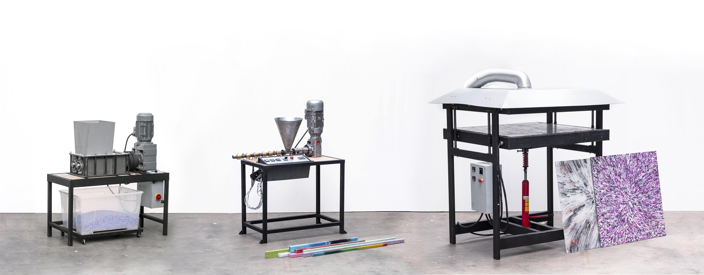

# Machine Inventory Guide

The machine inventory is a place for documenting and sharing Precious Plastic machines. These machines can come from the Precious Plastic team, machine shops / workspaces in the community, or individual members of the community. It was created for more machines to be shared within the community and more iterative versions of the machines from the Precious Plastic team. 

### Difference between Machine Inventory, Download-kit, and Library Projects

The download kit (which matches with the Academy) is for the place for the “final” content and designs. This is when we feel something is fully worked out and documented, and we want to encourage people to replicate it.

The machine inventory is for faster iterative development. There are many steps for a final design (and let’s be honest, final is never final). The machine inventory is for just that. It’s the place to find the latest and greatest from around the community, but not necessarily with all the documentation necessary to hold your hand all the way through. It’s best for machine builders who’ve had previous experience building Precious Plastic machines. 

Library projects are full step-by-step guides for how to do something in the Precious Plastic Universe. Whether it's a machine hack, unique collection system, new product or otherwise. The scope is beyond just machines, and has a higher lift in terms of amount of information you need to provide.

## Documentation

Complete and clear documentation is crucial for the development of open source projects. It’s also important for the way the documentation is harmonized - so that it appears the same across all the documents. This makes jumping from one machine to another immediately understandable.

### Naming a Machine 

There are three parts to naming machines in the Precious Plastic Universe:

1. Name of the Machine 
2. Big number (Large Change)
3. Small number (Small Change) 

When a machine is first added to the inventory, it would start at 1.0 . If there is a “big change”, then it would move to 2.0 . If there is a “small change”, for example changing the bolts or adding a different hopper design, then only the small number would change (2.1). 

✅ **Example: Shredder Basic 3.2** 

Name of machine 👉 Shredder Basic

Big Number 👉 3 (Third iteration of the machine)

Small Number 👉 .2 (Second small iteration) 

We refer to this as the *Model* of the machine (previously referred to as *version*). We made this change to reduce confusion between the version of the project (Precious Plastic version 4) and the model of the machine, which is not dependent on the version of Precious Plastic during which it was developed. 

If you sell your machines on the [Bazar](https://bazar.preciousplastic.com/) make sure to specify what model the machine is.

>Note: Please do not name your machines the same as the official Precious Plastic releases, unless it is a simple conversion (example: Shredder Basic 2.0 USA conversion). Instead choose your own name.

### Folder Structure: 

Ideally the folder structure should be the same for any machine added to the inventory and should follow this system:

	📁 Name of Machine
		📁 1. 3D CAD
			📁 STEP Files
			📁 Program Files (FreeCAD, Solidworks, Fusion 360, Rhino, Etc) 
		📁 2. Lasercut Files (DXF Format)
		📁 3. 2D Blueprints (PDF) 
		📁 4. Schematics
		📁 5. BOM (Libre Calc / Excel File) 
		📁 6. Other
			📁 Options   
			📁 Images 
			📁 Posters 
			📁 Templates / Jigs 
			📁 Upgrades 
			📁 …

## Design Principles:

These are the principles that guide design across the Precious Plastic Universe. The list is not exhaustive, but gives a general idea of what ideas to keep in mind for the design of the machines. 

* Open-source 
* Accessible (parts and materials found globally)
* Simple (avoiding overly complex parts)
* Replicable (considered the building process for others) 
* Appealing / Approachable  
* Systematic (mindful of the way this machine fits into the universe) 
* Durable 
* Resourceful 
* Customizable
* Collaborative
* Modular

# Filters

### Quality rating

Rating is introduced to make sure we can see at which stage the drawings are. To make sure the ones that have been running for a while withstand time, score a high rating and new drawings need to go to a verification process.

| Quality Rating |  Description           |
|---------|------------|
|  |   **Unknown**   The drawings of this machine are not according to any quality standard.         |
|  |  **Good Documentation**    The drawings are uploaded according to our guidelines (above)          |
|  |  **Reviewed Drawing**    Same as above + the drawings are also positively reviewed by Precious Plastic.        |
|  |  **Tested machine**   Same as above + we tested the machine in real life and it works well.    |
|  |  **Well Tested > 1 Year**    + We and community members used the machines for a long period of time and it works well.    |

### Difficulty level

Difficulty levels are to indicate how complex the tooling is needed to make the machines. This will give a better understanding upfront of the complexity you are getting into. They are divided into 5 different levels.

| Difficulty level |        Description     |
|---------|------------|
|  | **Level 1**    Only grinder / drill / welding
|  | **Level 2**   Same as above + lasercut / heating element cabling
|  | **Level 3**   Same as above + lathe work / motor cabling
|  | **Level 4**   Same as above + milling / multiple axis lathe work / VFD
|  | **Level 5**   Same as above + steel milling / pneumatic system or hydraulic system and some other complex stuff. Get yourself ready.

## Add Your Machine to the Inventory 

Want to add your machine to the inventory? Great! It's next level satisfaction to see your machine replicated around the world :)

## Guidelines for submitting 
* Must follow the naming system outlined above
* Must have at least a 3D CAD model documented 
* Must provide a public link to where your documentation is stored 

## Where should I publish my work? 
We don't mind where you are storing your files. Do what works best for you. Here are a few options:

* Google Drive
* [GitHub](https://github.com/)
* [GitLab](https://gitlab.com/)
* [Wikifactory](https://wikifactory.com/)
* [Grabcad](https://grabcad.com/) 

## How can I submit my machine to the inventory? 

We’ve created a [form](https://docs.google.com/forms/d/e/1FAIpQLSfTEshXP9IZuq5aoTi3z5l6bNfkBL1kLuVDxpDHQDXIYHehfQ/viewform?usp=sf_link) for you to submit your  machine to the inventory. We'll take a look at the information your submitted and see if it fits within our guidelines. If so, we'll add a thumbnail and link to the machine inventory. 

