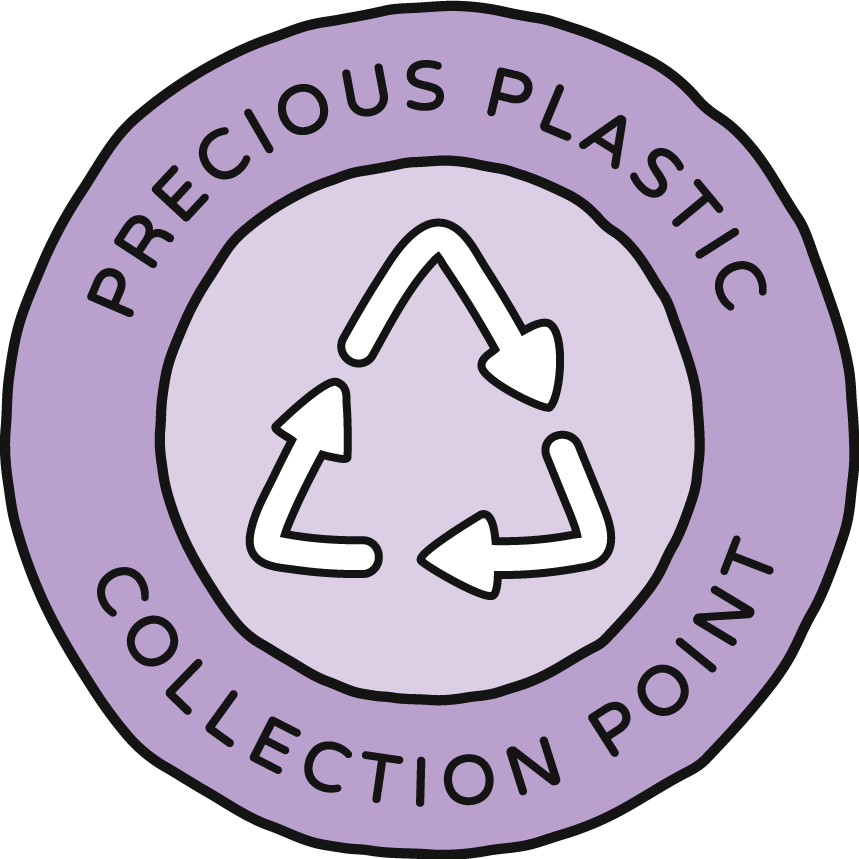

# Profile and Map Pin Guidelines
Hey plastic recycling friend 👋

First of all, welcome and cool that you found your way here (again)! 
This platform is made for you and everyone else in our global community to learn, share and connect to each other. We want to make sure that every pin on the map is really useful and fun to discover. 
So please take a minute to read our guidelines. 

## First things first... What's the difference between Profile and Map Pin?

The **profile** refers to the information and details about you. 
If you're a business owner, it should refer to your workspace or project, showcasing your work, products, and activities.
It serves as a comprehensive overview of your recycling work, including multiple images, descriptions, and links to social media platforms like Instagram, Facebook, YouTube and Precious Plastic Bazar, so make sure to complete it as much as possible.

On the other hand, a **map pin** represents the physical location of the workspace or project on the map. It allows users to visually see where different Precious Plastic spaces are located geographically. 
That's why on the map pin your information must be assertive: you just need a good short description and the correct location of your workspace.

Map pins are only available to Workspaces, Collection Points, Community Points and Machine Builders. If you're a Member you can add a map pin once you start your recycling activities. Meanwhile, head to the Academy to start learning!

Note: your Map Pin will be submitted for approval before going live on the Map, so make sure to fill the information correctly :)

## Guidelines

### What's your focus?

You can choose between different focus options. This might help you choosing:
|  |   |
| --- | --- |
|  | **Member:** You are keen on learning and sharing about Precious Plastic.   |
|  | **Collection Point:** You collect plastic waste on a regular basis. |
|  | **Machine Shop:** You build or help build Precious Plastic machines. |
|  | **Workspace:** You run a recycling workspace with Precious Plastic machines. |
|  | **Community Point:** You are a contact point with an overview of the recycling network in your local area. |

### Member

Are you keen on learning and sharing about Precious Plastic? Coool. 
This is an easy one :) 

#### Photo

Generally you can add a photo of your choice, but we would recommend taking a photo which shows your involvement in any activities related to plastic, if you can. 
Could be a photo of a cleanup you’ve been to, could be some plastic crafts and recycling experiments you made or an exhibition or zero-waste market you attended or supported. 

##### Examples: 

#### Description

Again, feel free to write whatever you want to share.
Especially interesting for the community might be: Your involvement in Precious Plastic or generally
plastic related activities. Your background/profession and skills you could offer to contribute to
projects, and maybe also what you are looking for.
This can help you to find and connect more easily with the right people!

#### Interact and connect with the Community

As a member you’ll be able to add How-to’s and events, but you won’t have a pin on the map. But if
there is a Community Point in your area, reach out, so you can connect with that local group :)

### Collection Point
You’re collecting plastic? Great! Here we’ll ask you for: 

#### Plastic types 

Select the plastic types you accept, so people know which ones they can bring to you and become more aware of the different types at the same time. 

#### Opening hours 

Should be clear, this shows everyone when they can drop by :) 

#### Photo 

Add how your space looks like, so it’s easier for everyone to find where they can bring their plastic. (If you have a logo, you can include it in the image, but please don’t take only your logo as an image. That makes it boring to explore and doesn’t show what you’re actually doing.) 
##### Examples: 

#### Description 

Write a little text about your Collection Point. It’s nice to include: 
- When did you start? 
- How do you wish to get the plastic (Cleaned? Sorted?) 
- How much do/can you take? 
- Where does the plastic go after it comes to you? (Always interesting to know) 

#### Map pin 

Add your location to enable people to find you. 

### Machine Shop

You build Precious Plastic machines? You rock! Here we’ll ask you for: 

#### Services 

Let people know what exact services they can expect from you. That saves others’ time and energy to ask questions, and it saves your energy to answer them. 

#### Photo 

Add a photo of the Precious Plastic machines you already built, so that people see you’re serious and what machines and quality they can expect. Another option would be to show your workspace. (If you have a logo, you can include it in the image, but please don’t take only your logo as an image. That makes it boring to explore and doesn’t show what you’re actually doing.) 
##### Examples: 

#### Description 

Write a little text about your Machine Shop. It’s nice to include: 
- When did you start? 
- Which machines did you build already or do you offer to build? 

#### Bazar 

As a machine shop, we would definitely recommend to add a link to your profile on the Bazar, so people can directly see more information about your machines, prices and services.

#### Map pin 

Add your location to enable people to find you. 

### Workspace

You run a Precious Plastic workspace? Yeeeah! 

#### Type of workspace 

Let people know which machine you’re mainly working on. If you don’t focus on one specific machine or output, select the MIX workspace. 

#### Photo 

Add a photo of your recycling machines (and/or some of your products), so that people see you’re serious and have fun exploring your profile. 
If you have a logo, you can include it in the image, but please don’t take only your logo as an image. That makes it boring to explore and doesn’t show what you’re actually doing.
##### Examples: 

#### Description 

Write a little text about your Workspace. It’s nice to include: 
- When did you start? 
- How big is your team? 
- Which machines are you working with? 
- What products/other activities are you doing? 

#### Bazar 

If you have products to sell, we would definitely recommend to add the link to your profile on the Bazar, so people can directly see more information about your products and prices etc.

#### Map pin 

Add your location to enable people to find you. 

### Community Point
Are you a local recycling community? Awesome! Here we ask for: 

#### Photo 
Add a photo of the people in your local community. For example, one of your meetups or cleanups. 

##### Examples: 

#### Description 
Write a little text about your group and activities. It’s nice to include: 
- When did you start? 
- How big is your group? 
- In which area are you working and connecting? 
- Do you have regular meetup times or open days? And when? 

#### Contact link 
Add an invitation link to the communication tool you mainly use (might be whatsapp, telegram, slack, wechat or others), so others can join the group easily. If you don’t have one yet, maybe consider setting one up! Check out more tips on this [How-to](https://community.preciousplastic.com/how-to/set-up-a-community-point).

Also include a contact/email of the main community builder in your group who has the best overview of the area and can answer newcomers’ questions.