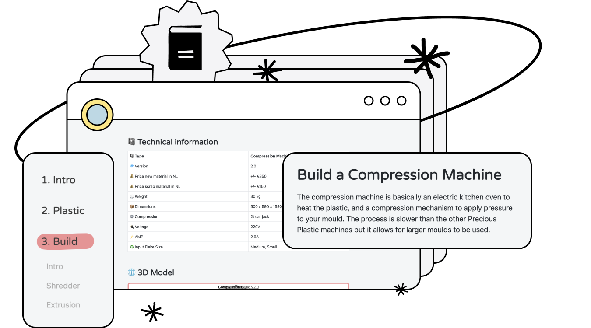
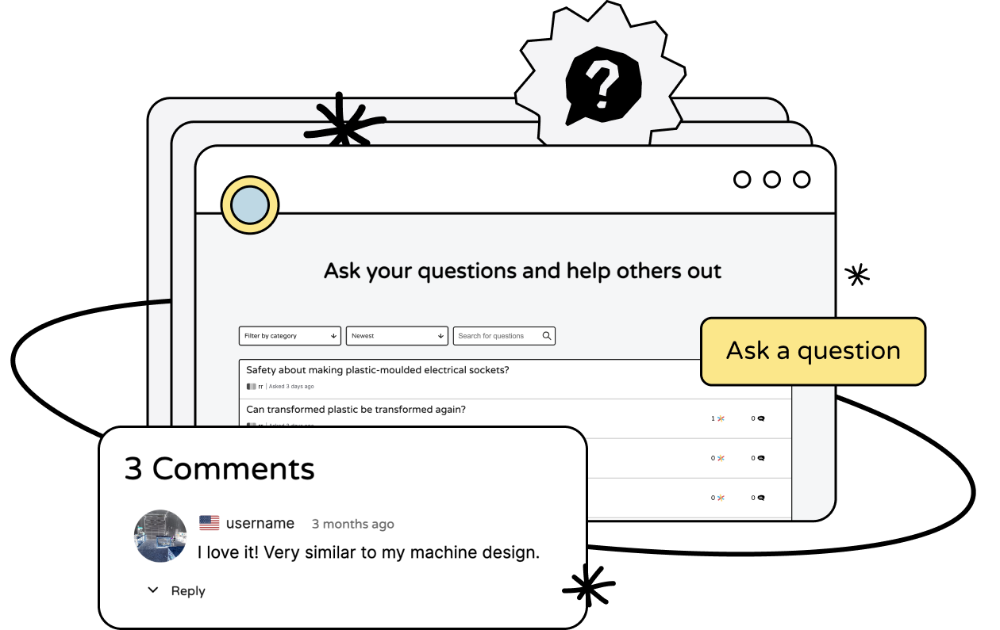
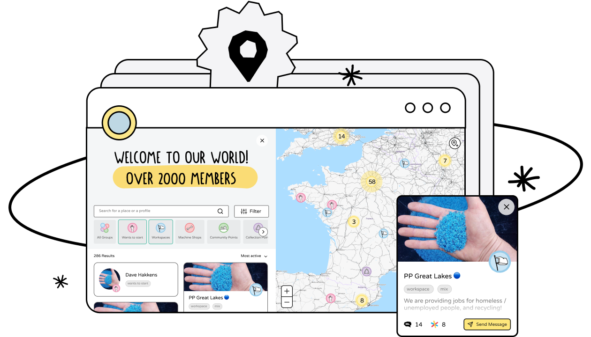
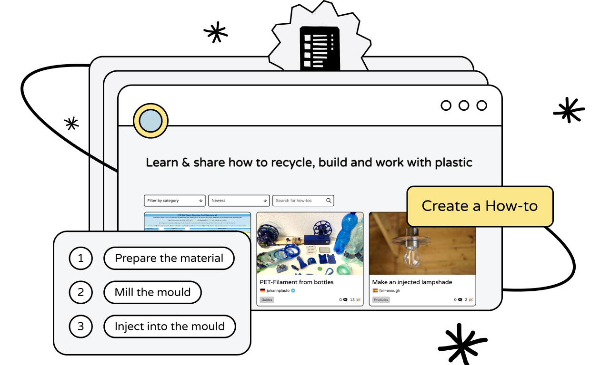
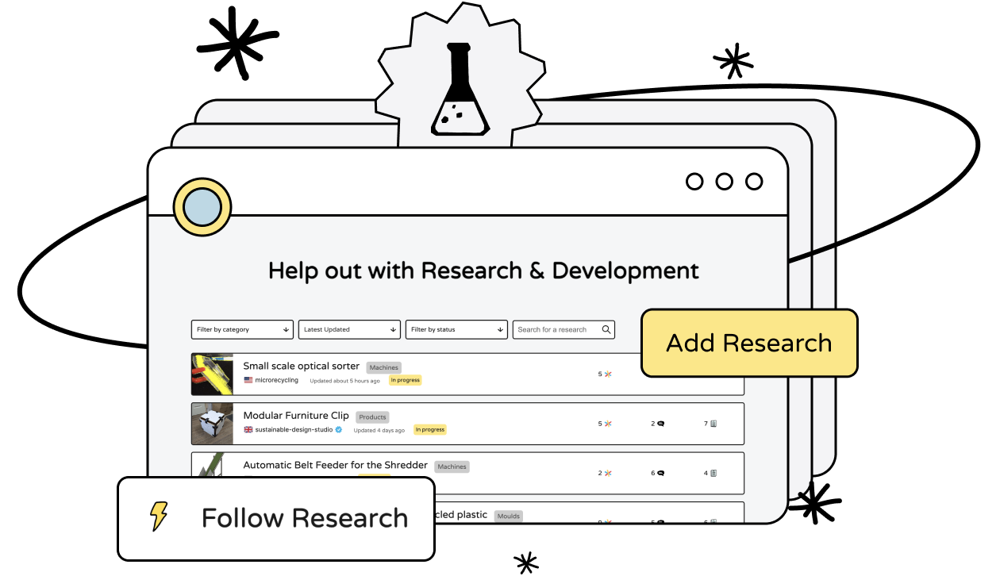

  
# Welcome to the   Community Platform
## The place where people meet, share and collaborate to tackle the plastic waste problem.

## Get started learning in our Academy

The central place for the knowledge and methodology developed by Precious Plastic. You'll find video tutorials, tips, drawings and much more on topics like plastic, machines, moulds, product design and business. 

[Visit Academy](https://community.preciousplastic.com/academy)

## Ask Questions to get support

Questions is a dedicated space for you to ask questions and seek support related to plastic recycling, if the information is not in our different modules. This space allows you to engage with others, share knowledge, and find solutions to common challenges faced while tackling the plastic waste problem.

Have a question about plastic recycling? If you haven’t found the answer in our knowledge libraries, ask the community and get the answers you need!

[Visit Questions](https://community.preciousplastic.com/questions)

## Browse the Map to connect with people

Search and find recycling spaces near you, connect, meet and start collaborating to push local plastic recycling in your area.

You’ll be able to find X organisations* who can be machine and mould builders, plastic collection points or workspaces who transform plastic and connect with more than X* people who want to get started!

Make sure to [create your own pin](https://community.preciousplastic.com/academy/guides/platform) if you are running a Precious Plastic space.

[Visit Map](https://community.preciousplastic.com/map)

## Find solutions from the community in how-tos

This is knowledge shared by the community. 
A How-to is a tool for people to share files, documents and guides on how they use their creativity to make plastic precious. Learn how people around the world create machines, moulds, make products, collect plastic and more. 

With more than X* How-tos already open-sourced on our platform, there's plenty to explore. 

If you have a unique solution, make sure to share it so more people can learn from you and work together to fix the plastic waste problem.

[Visit How-tos](https://community.preciousplastic.com/how-to)

## Help with Research to create new solutions

A place for users to share, collaborate and discuss various research findings, innovative ideas, and best practices in the field of plastic waste management.

Community members can engage in discussions about the X* ongoing research topics, provide feedback, and collaborate on projects.

[Visit Research](https://community.preciousplastic.com/research)

Are you interested to connect with the Precious Plastic community? Perhaps you want to learn more or share your own knowledge. Well you're in luck! We have created a <a href="https://community.preciousplastic.com/questions">Questions</a> section for the community to collaborate. Now if you want to chat with people locally and globally, check out the <a href="https://discord.gg/gwkbpsWbAB">Discord</a>

Ok, let's dive in!
