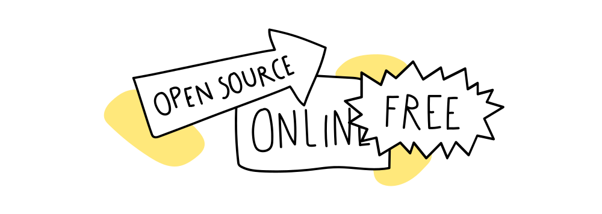

  <iframe width="800" height="400" src="https://www.youtube.com/embed/dP1s7viFZHY" frameborder="0" allow="accelerometer; autoplay; encrypted-media; gyroscope; picture-in-picture" allowfullscreen></iframe>

# Welcome to the Precious Plastic Academy!

### Awesome to see you are interested in recycling plastic.
We've created this collection of videos, tutorials and content to share the most crucial things we've learned over the past 7 years about transforming plastic waste into valuable products.

We will teach you about the basics of plastic - what types there are and how to identify them, collecting and separating plastic, building your own machines, business models you can adopt, how to become an important member in the Precious Plastic community, and much more.

We’ve created download kits and templates so once you’ve gone through everything, you’ll be ready to start your own recycling workspace, anywhere in the world!

### Video Chapters

- 00:00 Introduction
- 00:42 What will you learn
- 01:40 Help & Feedback
- 02:01 Donate
- 02:30 Spread the project

## But wait - why did you do this?

At Precious Plastic we want to show the world the incredible opportunities of plastic waste in order to eliminate plastic pollution, reducing the demand for new virgin plastic and closing its materials loop while creating better livelihoods for people around the world. Precious Plastic is, above all, a cultural tool to change the way society perceives plastic.

All plastic laying around you is a resource, not waste. It is a material with great potential, laying all around the world that, if processed correctly, can become something new and valuable. This resource can become a source of income or an educational tool for your community, while making sure it doesn’t enter our environment.

We have created machines, documentation, video tutorials, campaigns and a platform to empower people across the planet to start working with plastic waste locally while trying to decentralise and localise plastic recycling technologies, infrastructures and knowledge by providing open-source designs for machines, moulds and consumer products, as well as business models and tools for you to set up and run a recycling workspace.

## Open source & License
We share everything open source for anyone to use and benefit from. This means that all the knowledge, know-how, processes, methodologies and tools are available online, for free at all times. This open source philosophy is at the core of Precious Plastic and shapes most decisions within our team. We believe that collaboration is stronger than competition and that the plastic problem can only be solved collectively.

Different parts of this project are under different license conditions

- **Content:** All our content is licensed under Creative Commons Attribution - Sharealike International 4.0. You can read a summary of that [here](https://creativecommons.org/licenses/by-sa/4.0/), or check out the full [license](https://creativecommons.org/licenses/by-sa/4.0/legalcode).
- **Code:** Code license for the academy site is [GPL-3.0 License](https://github.com/ONEARMY/academy/blob/master/LICENSE).

## Support & get involved
If you are in the position to help there are many ways you can <a href="https://support.preciousplastic.com/">support Precious Plastic.</a>

Are you interested to connect with the Precious Plastic community? Perhaps you want to learn more or share your own knowledge. Well you're in luck! We have created a <a href="https://discordapp.com/invite/cGZ5hKP">Discord</a> to discuss all the things we're doing here. Check out the Questions section in the sidebar to see where you can chat with people locally and globally.

Ok, let's dive in!
