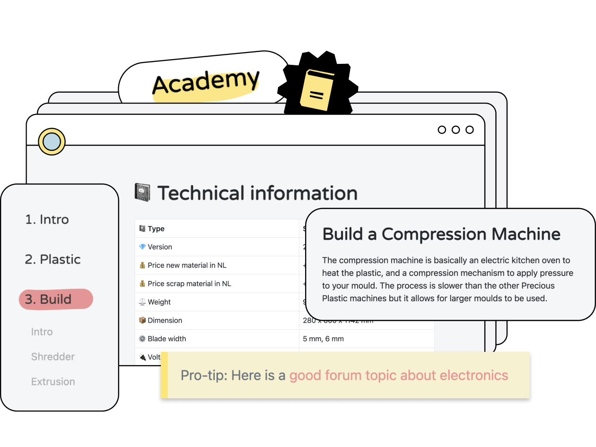
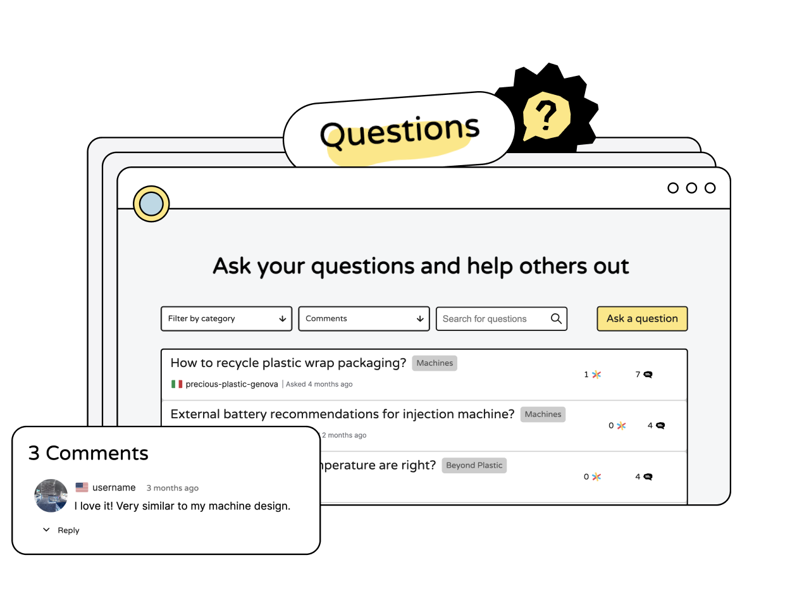
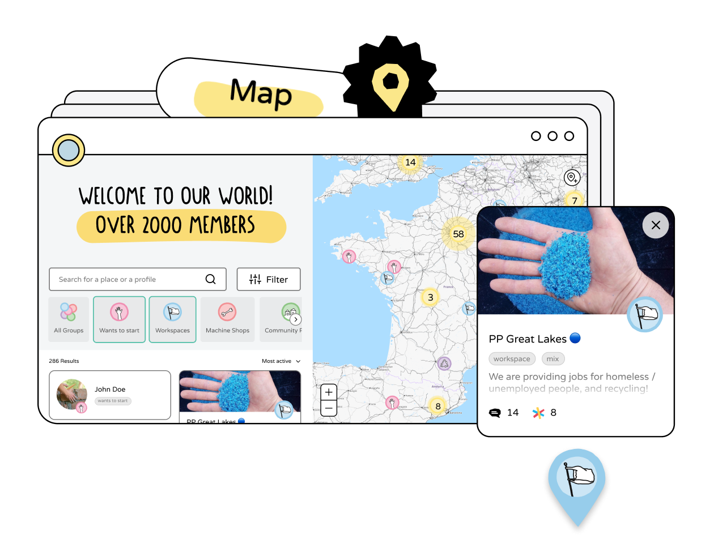
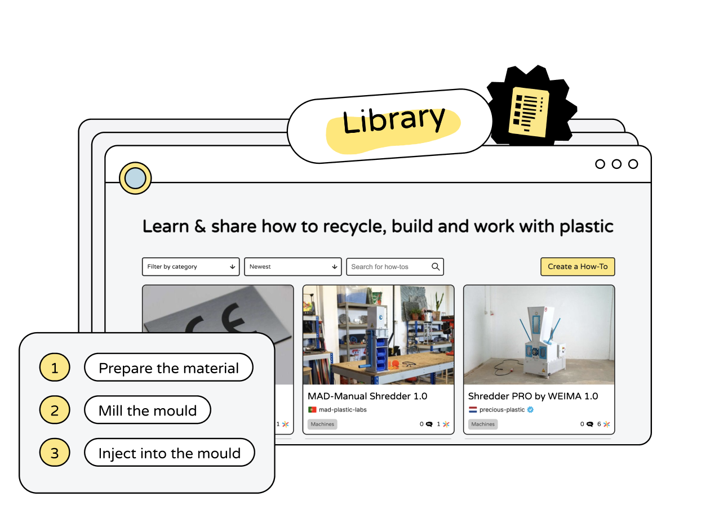
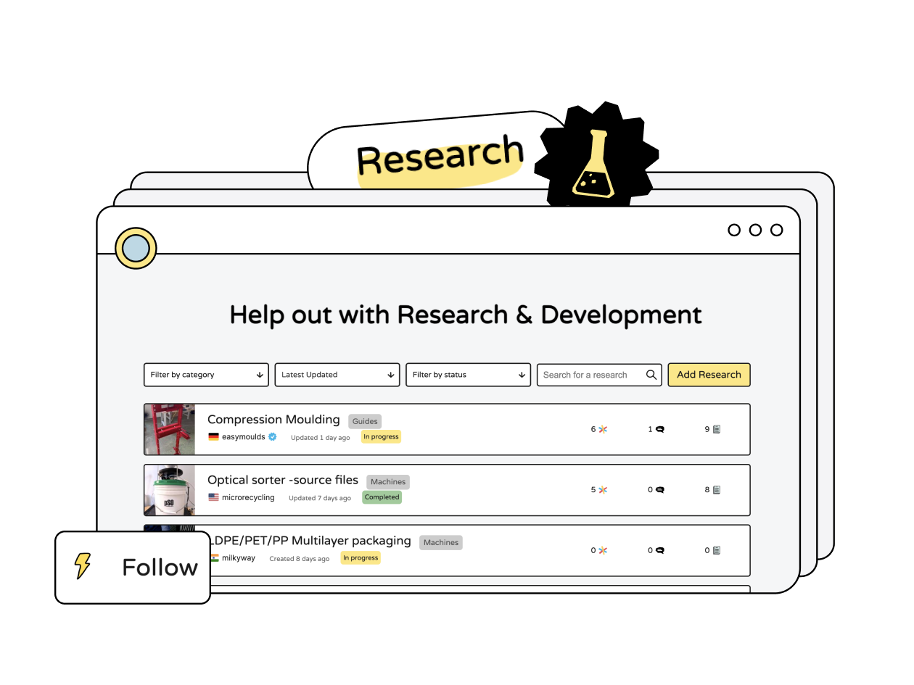

  
# Welcome to our   online community
## The place where people meet, share and collaborate to tackle the plastic waste problem.

  

## 📓 Get started learning in our Academy

Here is how you learn how to become a plastic recycler. You'll find video tutorials, 3D models, business models, tips, blueprints and much more 

[Visit Academy](https://community.preciousplastic.com/academy/start)

  

## ❓ Ask Questions to get support

Get community support for your plastic recycling questions. Engage with others, share knowledge back, and find solutions to common challenges. 

And don't forget to help out others :)

[Visit Questions](https://community.preciousplastic.com/questions)

  

## 🌎 Browse the Map to connect

Find local community members near you. There are over +1000 spaces, from machine builders, plastic collection points and recycling workspaces.

Add your [own space to the map](https://community.preciousplastic.com/academy/guides/platform)

[Visit Map](https://community.preciousplastic.com/map)

 

## 🔍 Find community solutions in our Library

Solutions made by the community. New products, blueprints of machines, 3D models of moulds, betters ways to collect and much more

There are +200 projects already open-sourced, lots more to explore!

[Visit Library](https://community.preciousplastic.com/library)

  

## ⚙ Help research to find new solutions

The place to continue R&D and find new soltuions to reduce plastic waste. Start a research and get help from the global community, get feedback ideas and collaborate.

[Visit Research](https://community.preciousplastic.com/research)

Ok, let's dive in!
