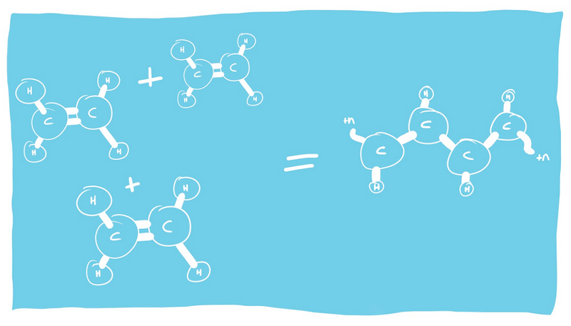
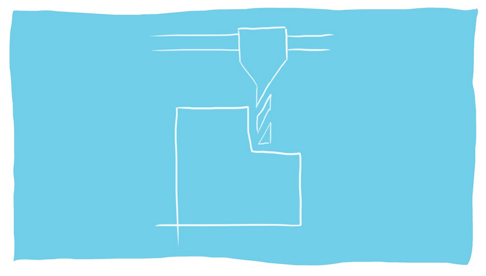

  <iframe width="800" height="400" src="https://www.youtube.com/embed/NpEaa2P7qZI" frameborder="0" allow="accelerometer; autoplay; encrypted-media; gyroscope; picture-in-picture" allowfullscreen></iframe>

# The Geeky on Plastic

### This is a great title for this section.

Let’s get into the details: when did plastic arrive in our society, and how did it grow from a small niche material to the huge reach it has today? In this video, Jerry takes us through how it all began, to the different categories of plastic, and why we work with thermoplastics only. He takes us through the common ways of producing plastic, as well as what happens after they are thrown out. 

`Pro tip: plastic tip`

### Video Chapters

- General Knowledge on Plastic 00.36
- Industrial Production Methods 06.58
- The Afterlife of Plastics 14.56

# General Knowledge on Plastic

Plastic started with a pretty noble mission! It was to find a replacement for the ivory used to make billiard balls in the early 20th century. It has since become a global industry worth billions of dollars, and as we know now, the effects of plastic production and waste on the environment is disastrous. 

As we discussed in the basics of plastic, another word for plastic is polymers. Poly stands for <i>multiple</i>, and mers stands for <i>units</i>. Polymers are a complex type of molecule, made up of monomers. You guessed it, mono stands for one.

So a group of <i>mono</i>mers create <i>poly</i>mers in a process called polymerisation. 

When it comes to plastic, the monomers come from fossil fuels, and through a process called cracking, create plastic polymers that with different production methods make up all the different types we have today.

## A bit of history

Plastic started with a pretty noble mission! It was to find a replacement for the ivory used to make billiard balls in the early 20th century. It has expanded through advancements in chemical technology during both World War I and World War II, with mass production beginning in the 1940’s and 1950’s. This lead to an entire cultural shift as it entered our society in manufacturing and consumer goods. It has since become a global industry worth billions of dollars.

## and a little more

In total there are hundreds of different sorts of plastic. The plastics that you see the most are the 6 types previous explained (PET,HDPE,PP,PS LDPE and PVC) and  these are examples of thermoplastics. These thermoplastics often have a recycling logo on them and most of them can easily be used with Precious Plastic machines.  But there are also thermosets like bowling balls or heat insulation which are not recyclable. Lastly you have elastomers. elastomers are somewhat in between thermosets and thermoplastics and examples of these are natural rubber, silicone or for example neoprene (yes, that stuff were wetsuits are made from)

That’s it for the general knowledge! Moving on to the next section.  

# Industrial Production Methods

The raw material of your plastic products is usually granulate. After the polymerisation process, the plastic is made into small beads or flakes, making it extremely efficient to transport and melt very easily. Recycling plastic has a similar process - you shred the plastic into small pieces ( sorted into their different types of course) ready to be made into new products. 

The simplest production method is <b>extrusion</b>. The plastic is extruded out of a die (video at 7.40) and starts with the feed part where the plastic granulate enters a special screw, and the screw moves the plastic through all the way to the die. The shape of the screw changes diameter from beginning to end exposing it to a lot of heat and pressure resulting in a fully molten plastic when it reaches the end of the screw. From there it enters the die - you can use different shapes dies for different products. 

You can also use techniques like blow-molding, where you take the output of the extruder when it is still warm and blow it into shape with the help of compressed air and a mould. 

The second, slightly more complex method is <b>injection molding</b>. For this process, plastic is injected into a mould, solidified and cools down. When it’s cooled, it keeps the shape of the mould. You can make a lot of products with injection molding, for example lego pieces, toothbrushes, CD cases, or cutlery. <a href="url">Want to learn more about moulds?</a>

Another industrial production process is <b>thermomolding</b>. Sheets are heated to a pliable temperature, formed into a specific shape and then cooled and trimmed. This process is often used to create disposable cups, containers, lids, trays - a lot of thin-walled plastic items that are used in the food, medical and general retail industries. 

<b>Rotation molding</b> is used to create low-quantity large plastic items. Plastic pellets are placed in a mould, and is molten with heat while heated evenly. The process is quite flexible as the mold doesn’t have to withstand high pressure. It’s very labour intensive though and take a significant amount of time. 

<b>Additive manufacturing</b>, or 3D printing is a relatively new production process. Here, multiple 2D layers make up a 3D shape and the benefit is that you don’t need a mold so you can change the design as much as you want. However this process is slow and currently it is rather difficult to make 3D printing filament from household waste.

Lastly, you can also process plastic in a more <b>manual</b> way. You can drill it, mill it, turn it on a lathe, sand it. It feels more like a craft and there are some beautiful results. Interested to learn more about these techniques? <a href="url">Check out out How-To's!</a>

# The Afterlife of Plastics

So, we’ve learnt that most plastics on the market are easy to identify, sort, shred and make into new products, and ideally, this would work locally and globally. Unfortunately this is not the case - approximately 2% of plastic packaging is recycled in a closed-loop process, this means that only 2% of packaging is recycled to make new packaging. Another 8% is down-cycled, meaning the quality is degraded and a lower quality product is made. 

Plastic recycling is made difficult because it is often mixed with other materials, because it is difficult to disassemble, because multiple plastics are fused together or because many additives are added to the plastic. (picture) 
A few of the different ways to identify the plastic as explained by Jerry are: 

<b>Density Testing</b> - this technique takes advantage of the different densities of plastic types. Each plastic type has its own specific density that will make it float differently in liquids. The floating liquid can be salted water, alcohol, vegetable oil and glycerin and is used intensively by the industry. However, it only separated 2 types of plastics, if you have you a mixed batch of plastic you will need to repeat this multiple times. And it can be very tricky, particularly because of the additives mixed with plastic that can change its density making it inaccurate.

<b>Infrared Testing</b> - this process is very efficient and it works by shining an infrared light (usually on a conveyor belt) to different plastics. Because each plastic has a different molecular structure, the response back can be easily identified. Unfortunately where the technology is at now, darker pigments in plastic can mix the signal, so there is often misreads of plastic. 

