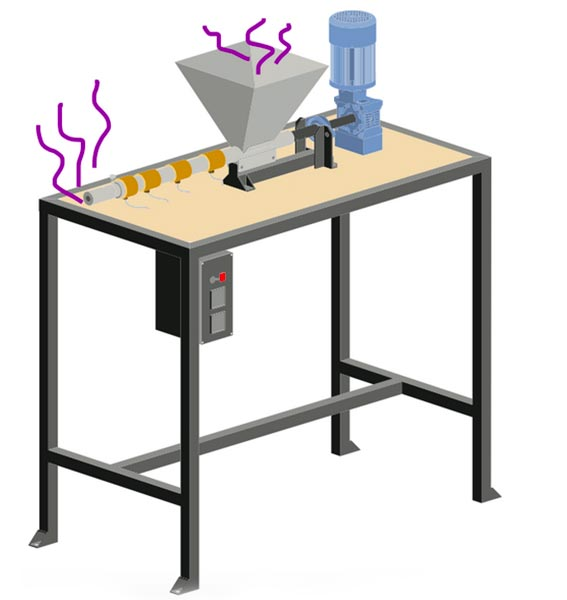

  <iframe width="800" height="400" src="https://www.youtube.com/embed/NpEaa2P7qZI" frameborder="0" allow="accelerometer; autoplay; encrypted-media; gyroscope; picture-in-picture" allowfullscreen></iframe>

# Safety and Fumes

### It's important to take this seriously.

Safety is a huge topic when working with plastic, it’s extremely important to take the right precautions - then you are completely safe. We’ll walk through the dangers of fume exposure and which plastics are unsafe to work with, and we’ll go through how we set up our filtration systems at Precious Plastic. 

 

Try to melt your plastic at the lowest temperature possible and for the shortest amount of time.

### Video Chapters

- 00.18 Fume Dangers
- 03:01 Fume Test
- 06.14 Tips
- 07.53 Filters

# Fume Dangers

<i> << 6. don't burn plastic >> </i>

The first rule is: don’t burn plastic. This one is very important. Why? It is extremely harmful to you, those around you and the environment.  Very harmful toxins are released when burning plastic and can significantly increase the chances of cancer, respiratory illnesses and birth defects. It can also greatly damage internal organs and the hormonal system. 

When burning PVC, dioxins are released which a highly toxic compound that has been shown to increase cancer, reproductive problems and immune system damage. At Precious Plastic, we don’t work with PVC.

If you do need to burn a small piece of plastic to identify its type, then do so taking the proper precautions: wearing a mask and beside a proper fume filtration system. The most important thing about working with plastic: <b>You can melt it, you just can’t burn it.</b> And that’s an important difference. 

##  Volatile Organic Compounds (or VOC’s)

All plastics are made up of large molecules and when melted they make smaller molecule as fumes. These fumes are also called Volatile Organic Compounds and are very dangerous - immediate effects are severe irritation to the eyes, nose and lungs and prolonged exposure to fumes of any synthetic plastic with no safety precautions can lead to cancer, birth defects and illnesses..

As seen in the graph below, fume contents of common plastics were studied by the Air and Waste Management Association, Chinese Academy of Sciences and The University of Tokyo. The studies concluded that <b>ABS and PS created the most fumes: approximately 5 to 7 times more than the other plastics.</b>

Fumes from ABS and PS contain styrene, benzene and ethylbenzene - these compounds are called cyclic compounds which create a lot of fumes and may cause cancer. Benzene is a human carcinogen, and styrene and ethyl benzene are probable carcinogens (probable carcinogen means that the compounds have not yet proven to cause cancer). Luckily, all of these cyclic compounds can be easily filtered with activated carbon, but more on that later!

The safest plastic to melt is PP and PE because they are low in cyclic compounds and they are essentially refined wax. PVC and PA are low in fumes but the contents are harmful to melt.

# Fume Tests

For fume testing, we use a PID detector, which stands for photoionization - this detects the fume safety levels for VOC’s and can inform us where exactly the fumes are coming from. The advantage of using a PID sensor is that it’s very accurate and can be handheld, allowing us to design a flexible fume extraction system that we can move around.

When air enters the PID, a UV light interacts with the molecules in the air - organic compounds release positively charged ions when they pass through the light which are then captured by a negatively charged plate, producing measurable electrical current.

Our results: 

In our workspace we detected fumes 2 cm from the source and it was approximately 14 times higher than the recommended maximum. PS created 5 times more fumes than HDPE and PP: this means that HDPE and PP are very low in cyclic compounds. We also detected where the fumes come from in each machine (more on that below).

We used a commonly used regulation: the maximum 3-hour concentration of hydrocarbon content is 0.24 ppm, not to be exceeded for more than a year [2]. In conclusion, <b>our biggest threat is styrene vapor formed from PS melting.</b>

For more detail, visit: https://tinyurl.com/y5r2u3u4

## Fume Sources from Precious Plastic machines

Ok, so where do fumes come out of Precious Plastic machines?

<b>The Injection Machine</b>
 
1. Fumes come out from the nozzle when you take off the mold
2. Fumes come out of the hopper when the injector handle is up

<b>The Extrusion Machine</b>
 
1. Most fumes comes out from nozzle
2. Some fumes from hopper when not blocked by pellets and from the mold openings 
3. For example, when making a beam, fumes come out at the end of beam mold

<b>The Sheetpress</b>
 
1. Most fumes come out from all four sides
2. If heating is uneven fumes come out from certain overheated areas 
3. Fumes were still coming out for 7 minutes at the cold press stage

# Tips

- Wash plastic well before melting it. Residues from cleaning products can create harmful fumes. 
- Never melt unseparated plastic,  because different plastic types have different melting temperatures, meaning some plastic will burn before others are melted. 
- When working with PS or ABS, make sure you don’t melt it for more than 8 hours per week, and always use a gas mask and ventilation. 
- Don’t use a regular dust mask, that won’t work! Make sure you use an activated carbon filter gas mask. And make sure your gas mask is fitted properly!
- Try to melt plastic at the lowest possible temperature for the shortest amount of time
- If you ever feel dizzy, or it’s hard to breathe, move away from the fumes into fresh air. 
- Keep away from the fume source - it’s 14 times higher than the recommended maximum exposure.  If there’s no ventilation, you have to have a mask and stand about 2m away.
- Fume caddies with an adjustable arm is needed for extrusion and injection. For the sheet press, a fume extraction hood should be included in the machine design.
- Buy a low-cost VOC detector to check if the air in the workshop area is safe, and to check if the filter is working correctly.

# Safety Gear

When working with plastic, you should have an activated carbon filter gas mask, and a stand-alone extraction filter, which also uses activated carbon. It’s an incredible material, and a lifesaver! We chose to use this because it filters cyclic compounds very well and is easily found everywhere around the world. We also can build LEV systems with activated carbon filters into machines or specific areas in the workspace.

## Ventilation (LEV)

LEV stands for Local Exhaust Ventilation, which is an industry standard to ventilate toxic air efficiently. This system is made of three parts: a hood for allowing contaminant clouds to enter the LEV, ducting which transfers air and the contaminant from the hood to the discharge point, and attached to a centrifugal fan with 780-1000 cubic meter (of what?) per hour.

## Activated Carbon

Using an activated carbon filter (ACF) is the cleanest and easiest filtering method. It has a large surface area and is treated to have more pores than normal carbon - fumes stick very well to these pores making it a great material to filter out the nasty stuff. ACF will remove the following VOC’s very well: toluene, xylene, styrene, alcohol, benzene, decane, ethylbenzene, heptane and octane, and the following gases: pentane, acetone, hexane [3]. Porosity is the most determining feature of activated carbon. But they don’t last forever, you need to change the filter. While the compounds are invisible to us, they have a distinct smell that is normally filtered out. Once you can smell them, it’s time to change the filter. 

### Stand Alone Filters 

A filter like this costs approximately 40-50 euros and has roughly 2-3 kg of granular activated carbon which needs to be changed each month(you can also get bigger filter which will last longer). These filters can be attached to centrifugal fans for the ventilation. Preferable conditions for using these filters humidity under 70% and ambient temperature lower than 80°C. 

### Buying carbon granules (for VOC removal)

When the filter needs to be changed, you do not have to buy a new filter. Instead, you can buy activated carbon granules to change the spent activated carbon - this spent carbon can be placed in a municipal landfill. It is best to buy activated carbon with Iodine number bigger than 1050mg/g - Iodine number is an indication of active surface area (the bigger the iodine number the better the filtration).

### Gas Mask

A gas mask is also extremely important, as the filtration is not 100% so this acts as an extra barrier. Even in large industrial recycling and manufacturing they haven’t reached clean air, so gas masks are common practice. The most common masks are 3M masks and have four parts: the mouthpiece, the filter cartridge, a dust filter holder and a dust filter. They can be used for 50 hours before the cartridge and dust filters need to be replaced. 

# So, that’s it! 

If you take the proper safety precautions of a proper gas mask and extraction filtration, you are safe. Don’t work with PVC or ABS, and the safest plastic to work with is PP, LDPE and HDPE. Remember though, you can only melt PS for up to 8 hours per week.

[All resources](https://drive.google.com/drive/folders/1MSfb8R3ZWbrJv6FxL1JpLioZ9i8KFD0D?usp=sharing)

1. [Pollution characteristics / health risk assessment of VOCs emitted from different plastic solid waste](http://iehpc.gdut.edu.cn/2015-7.pdf)
2. [Removal of VOCs from polluted air](http://beta.chem.uw.edu.pl/people/AMyslinski/nowy/zarzadzanie_01/literature_HWW/02.pdf)       
3. [Evaluation of GAC filters to remove VOCs](https://www.isiaq.org/docs/papers/940.pdf)

