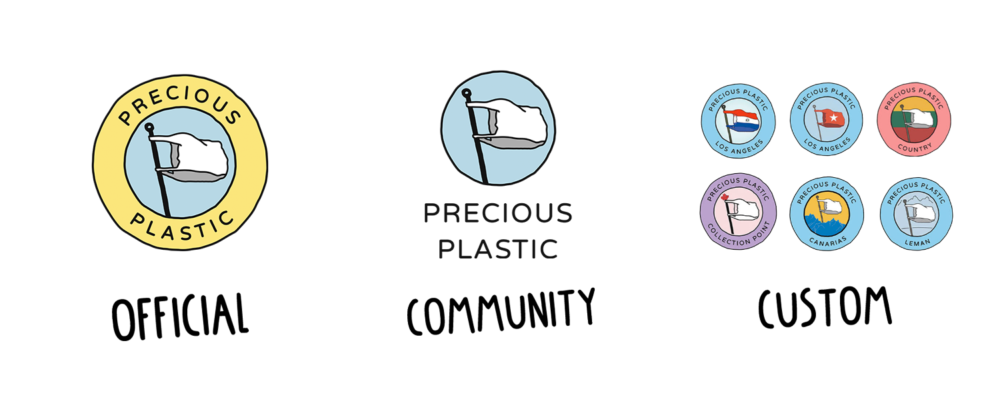

# The style and graphics behind Precious Plastic
Precious Plastic if a global Open-Source community. This means people can take and make whatever they want. So we have individuals, groups and us in the headquarters making graphic material like posters, website and stickers. But we like to collaborate on a global scale. Instead of making a lot of random things, we like to keep them coherent. So if someone makes something, someone else on the other side of the world can use it as well. And in order to achieve this we have some style- guides.

# Our different logo's
There are basically 3 different types of logo's we use. Each of them have their own function.
1. **Official Logo:** This logo is only used by the headquarters, you can see this on the website and graphic materials we make. We use a different logo because we don't operate as a Precious Plastic Space, we do development and run infrastructure for the community. The logo helps people to see what is official. *Do not use this logo*
1. **Community Logo:** This is used for things made by the community for the community. For instance posters, stickers, t-shirts a community driven forum. Things that other members around the world as can use as well.
1. **Custom Logo:** These logo's are used by [Spaces](../spaces) around the world. Community Points, Workspaces, Machine Shops & Collection Points. The logo can be customized to your needs with your own name, more on that in the [next chapter](../universe/yourlogo). These logo's are used to promote your own space, business cards, sign outside your workspace, social media account etc.

# Using our font
We mainly use 3 different fonts. For titles, subtitles and written text. For titles we use our own made Precious Plastic font, can be found in the download-kit. It's nice to use big an bulky. We use Varela Round for subtitles, like there in the academy. We prefer to use it a bit more bold and often in uppercase. It's used in posters and actually also in the logo! And finally we have a text for text, most of our text is digital. For this we use System-Fonts.  These fonts are already on your computer installed. This makes it easier to load and saves bandwith. But it does look a bit different on each device.

# Precious Plastic colors
Colors are key for us, we love them. They are friendly and represent shredder plastic for us. But we also love them to stay organised and make things clear. We don't use them randomly, they are nested in our DNA and UX Design. We started using them in the Academy a few years ago and kept building upon them. Here are our main colors;

## Academy colors
| Color   |  Location & Hex code         | Color | Location & Hex code                  |
|----------|---------------|--|--------|
|  | __Intro__   #CDCFD5    |  | __Business__   #F6B67B	|
|  | __Plastic__   #95D2EF |   | __Spaces__   #2DAE9E |  
|  | __Build__   #F19093 |     | __Research__   #798BC5 |
|  | __Collect__   #C0ADD4 |   | __Universe__   #F18DAF |
|  | __Create__   #FCDE8A |   | __Support & Download__   #CDCFD5 |

## Spaces colors
|  color | Location & Hex code           | color | Location & Hex code                   |
|----------|---------------|--|--------|
|  | __Community Points__   #B7D6E3    |  | __Workspaces__   #95D2EF	|
|  | __Collection Point__   #C0ADD4    |  | __Machine shop__   #F19093	|

# Make graphics for Precious Plastic
Graphics are a powerful tool to communicate a message. We use it to share dry functional information like melting temperatures and different types of plastic. We use it to trigger people and look different at plastic, for instance with our campaign posters from the Collection Points. And we use it digitally, on social media and our website. And there are probably many different purposes and things to make, we don't have an example for everything nor have all the guidelines in depth. The best thing to do is have a look at the graphic material we already provide, take them as an example or template an build upon that. And if you are unsure wheter it looks good, just share it in the Discord, many people love to share their opinion on it :)

