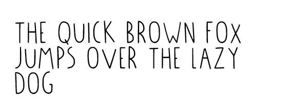

# The style and graphics behind Precious Plastic
# Using the logo correctly

# Make posters for Precious Plastic
- location is for community Points
- name not to Long

# Using our font

- customize logo based on roles
- change 1 variable, color background, illustartion
- save as eps

# Using background background strokes

# Precious Plastic colors

## Academy colors
| Color   |  Location & Hex code         | Color | Location & Hex code                  |
|----------|---------------|--|--------|
|  | __Intro__   #CDCFD5    |  | __Business__   #F6B67B	|
|  | __Plastic__   #95D2EF |   | __Spaces__   #2DAE9E |  
|  | __Build__   #F19093 |     | __Research__   #798BC5 |
|  | __Collect__   #C0ADD4 |   | __Universe__   #F18DAF |
|  | __Create__   #FCDE8A |   | __Support & Download__   #CDCFD5 |

## General colors
|  color | Location & Hex code           | color | Location & Hex code                   |
|----------|---------------|--|--------|
|  | __Primary color__   #B7D6E3    |  | __secondary color__   #FCDE8A	|
|  | __Workspace__   #B7D6E3    |  | __Machine shop__   #FCDE8A	|
|  | __Community point__   #B7D6E3    |  | __Collection Point__   #FCDE8A	|
|  | __Member_   #B7D6E3    |  | __Collection Point__   #FCDE8A	|
|  | __Logo Ring__   #B7D6E3    |  | __Logo background__   #FCDE8A	|
