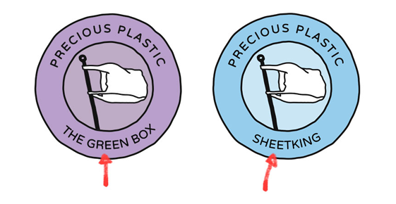

# Make your own logo!

Hi there, good to see you. In this page we will show you how to make your own Precious Plastic logo. We have a few tips and trick that help you make a good logo, and we provide some files in the [download kit](../download). The goal is to help you to have a strong logo to use for your space. One that uses the worldwide brand recognition of Precious Plastic, is customized to your environment and works within the [ universe ](../universe/universe).

>We are open-source so you can basically do whatever you want, but if we all stick to the guideliness everything will run smooth and we collaborate on a global scale

# Step #1 - Pick the right logo color
The colors in the logo are used to see the fucntion in the Universe. Make sure you pick the right color that fits your space.

| Workspace   |   Community point  | Collection Point | Machine Shop |
|----------|-------------|------------|------------|
|  |  |    |  |

# Step #2 - Select a name
Change the name of the bottom of the logo to your own. Use the file in the downloadkit to start of with. A few things to keep in mind when picking a name. Don't use your location (country, city neigberhood) unless you are a community point. We need multiple Precious Plastic spaces in easy area, if you claim the location name it prevents others from using it. Location names should be used by community points so they can be the main point of connection for new members. Any other name can be used. In general we recommend to use a short name, fits better and easy to remember.

# Step #3 - Customize the logo
This is where you can get creative, customize the logo. The flag is powerfull to use as a recognition. More and more people get to know it and it creates a powerful ecosystem. So we reccomend to not change it to much. There are good and not so good ways to customize the logo. Overall the trick is to not change it to much to benifit from the brand awarness of Precious Plastic around the world

## Only change one variable
We advise to not change the logo to much, but this is still a bit..abstract. So one guideline that makes it easier to hold on to is, __only customize one thing.__ You could change the color of the flag to your own area, change the background color or add your own illustration inside. But don't change 2 things at the same time this makes it messy.

## Good & Not so good
Below a few examples that stick to the guideliness and some that are not. Good luck with you own logo. If you need help or feedback join our [Discord](https://discordapp.com/invite/zmf98dw).  

