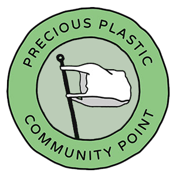
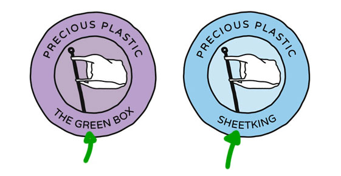
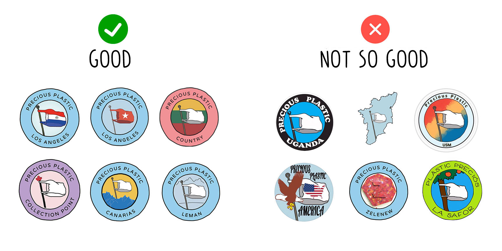
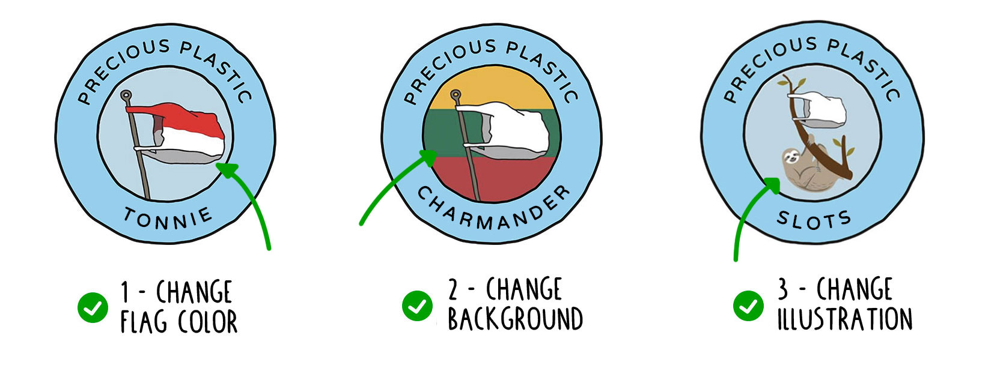
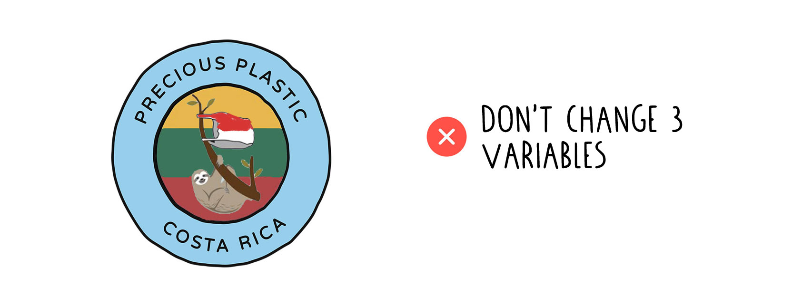
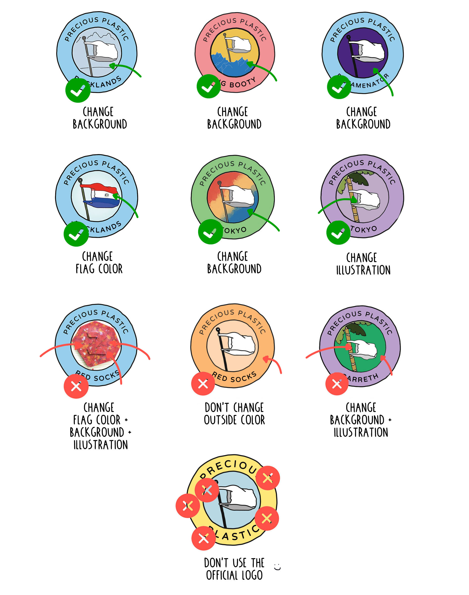
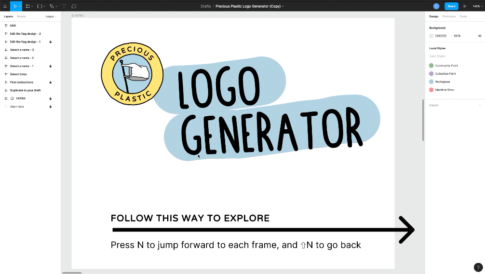

# Make your own logo!

Hi there, good to see you. In this page we will show you how to make your own Precious Plastic logo. We have a few guidelines and tips and trick that help you make a good logo. We provide some files in the [download kit](../download) and have a cool online tools as well But more on that later. Overal the goal is to help you to have a strong logo to use for your Space. One that uses the worldwide brand recognition of Precious Plastic, is customized to your environment and works within the [ Universe ](../universe/universe).

>We are open-source so you can basically do whatever you want, but if we all stick to the guideliness everything will run smooth and we collaborate on a global scale

# Guideline #1 - Pick the right logo color
The colors in the logo are used to see its [function in the Universe ](../universe/universe). This is very helpful for our community see what role you full-fill. Make sure you pick the right color that fits your space.

| Workspace   |   Community point  | Collection Point | Machine Shop |
|----------|-------------|------------|------------|
|  |  |    |  |

# Guideline #2 - Select the right name
A few things to keep in mind when picking a name. Don't use your location (country, city neigberhood) unless you are a Community Point. We need multiple Precious Plastic Spaces in each local area, if you claim the location name it prevents others from using it. Location names should be used by Community Points only. They are the main point of contact for new members in your area. Any other name can be used though. In general we recommend to use a short name, fits better and easy to remember.

# Guideline #3 - Customize delicate
This is where you can get creative, customize your logo. The flag is powerful to use as a recognition around the world and only becomes stronger. More and more people get to know it and it creates a powerful ecosystem. So we recommend to not change it to much. There are a few good and not so good ways to customize the logo. Overall the trick is to not change it to much to benifit from the brand awarness of Precious Plastic around the world

## Only change one variable
We advise to not change the logo to much, but this is still a bit..abstract. So one guideline that makes it easier to hold on to is, __only customize one thing.__ You could change the color of the flag to your own area, change the background color or add your own illustration inside. But don't change 2 things at the same time this makes it messy.

## Good & Not so good
Below a few examples that stick to the guideliness and some that are not. Good luck with you own logo. If you need help or feedback join our [Discord](https://discordapp.com/invite/zmf98dw).  

# Let's make you logo!
We provide 2 options to make your own logo. For both you need to install the Precious Plastic fonts. Make sure to keep the above guidelines in mind and if if you need help you can ask around in our [#Universe](https://discordapp.com/invite/QUw8A3w) channel in Discord.

1. **The oldschool way:** Download al the files and templates from the [download-kit](../download). You can use your own software to modify. Photoshop, Illustarter, GIMP, Sketch, paint. Whatever gets you going.

2. **The new way:** Use Figma, a free online tool. We like to use it at Precious Plastic to create graphic assets.
It's free and Multi-platform (Windows, Mac and even Linux) which makes it a great tool to collaborate. 
2.1 - You need to create your on account. Go to www.figma.com and click on Sign up (top-right corner).You can either download the [desktop app](https://www.figma.com/downloads/) or use it directly in your browser. If you choose the second option, then you need to install the [Font Installer](https://www.figma.com/downloads/) to use the custom Precious Plastic font within the software. 
2.2 - If you want to learn more about Figma and how to use the editor you can watch [this video.](https://youtu.be/DSrbwCrEIII) 
2.3 - Once it's done, we're ready to create your logo. Follow this link: 
https://www.figma.com/file/YpkQ9zzWMLS1R47pJcKBxJ/Logo-Generator. 
All the instructions are included in the file.
Enjoy & be creative!

<b>Have questions or need help making your logo? Head to the [#Universe](https://discordapp.com/invite/QUw8A3w) channel on Discord. Here we talk about how you fit in the universe, roles, branding and your own logo.</b>
