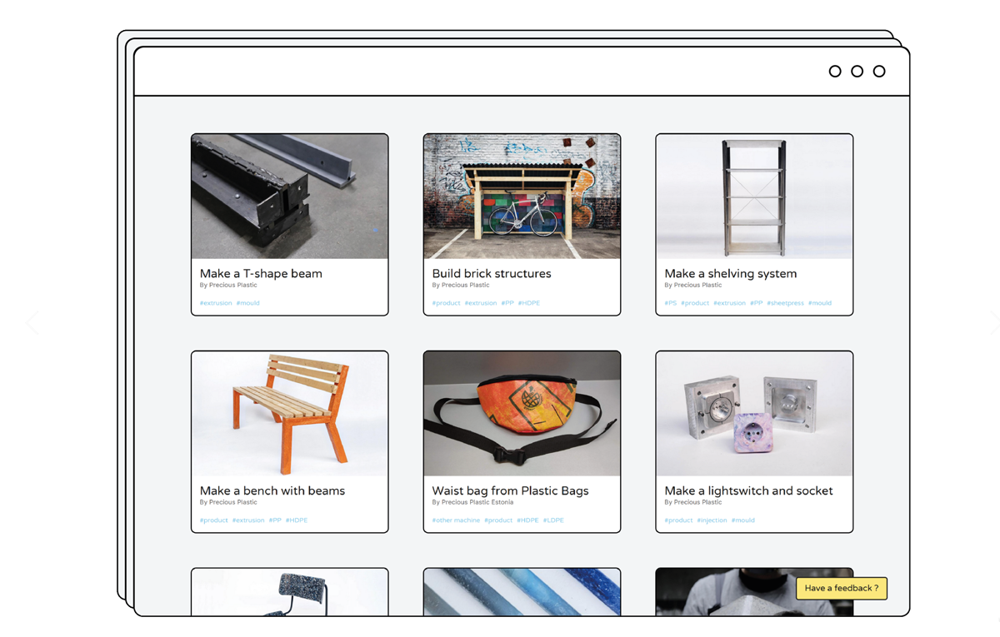

# Why sharing back is crucial for our future

Hi good to see you clicking this section of the Academy. This topic is very important for the future of Precious Plastic. Let me explain, community power 💪 Most of the development published here in the Academy comes from the headquarters, we invite people from the community to our workspace and develop new things. This is for sure a fun and powerful way of developing. But it also requires quite some resources (budget, food, beds, space etc) And realistically we are never able to invite each one of you plastic experts here to the headquarters. And with a growing community and members around to world we (the community) figures out a lot of things on a daily base, improvements, machine hacks, washing systems, safety features etc. More and more we need to share knowledge with each-other, from around the world remotely. So we don’t all have to make the same mistakes and we can learn from each other.

## 5 reasons why you should share back

__1. 🏅 Digital Street Credit:__ It strengthens your credibility in the community. People tend to help more if they see you contribute.

__2. 🤝 Help others:__ Obviously people can just copy/past your work. which is amazing. But even if they don't exactly do it. Just sharing your process helps a lot for people to learn and gain knowledge. It's either way useful.

__3. 📝 Knowledge stays relevant:__ People are in different stages of development. So others might still use the knowledge you uploaded 3 years later for their project. It takes you some effort ones but keeps living on and helping people for years to come. -getting karma points for years!

__4. ⭐️ You already did the hard work__ When you are thinking about documentation you already did most of the work. You made a machine, designed a product, made a hack etc.. Basically 95% of the hard work is already done! But you just need to do that tiny last 5% which is about sharing back.

__5. 🙃 Five sounds better then four:__ So point 5 is just to make a point

# Centralised documentation: How to’s

Documentation and sharing knowledge is actually one of the challenges with working open-source. You easily end up with knowledge shattered on the web. Forums, Discord, Slack, Stackoverflow, comments etc. It easily becomes a mess making it very hard to really find good long term information back. Thats why we started working on [How-to's](https://community.preciousplastic.com/how-to). A centralised place in the community where members can upload their design, lessons, hacks, upgrades etc. You can filter on tags to find what you need and refer to other how-to. Its a place to centralise all the things we as a community learn. Because there is still a lot to figure out when it comes to plastic recycling. So we need each other.

> Note: The how-to’s are still very much under development. Many features like commenting and saving are still missing. But the more you use it the easier for us to gather feedback and add improvements. So help us pioneering to make it better for the rest

--------------
# How To make a.. How-to

Processes and development can be complex. It’s easy to get lost in the perfection of creating the perfect how-to with 45 steps. Aim for that. We love those. But realistically most other makers can get a lot of information from a good 3D model or a few pictures. If you upload that with a few steps thats explain roughly whats going on and why you are doing already helps a lot.
 Here a few guidelines to take in account

### ✏️ TEXT
- max. 700 characters per step
- Keep it simple! Think of your documentation as a beginners guide.
- We recommend simple language and a conversational tone.
- It’s better to have more easy steps than a few very complex ones.
- If you have too much information to put into one step then try to split it up into more steps.
- Add downloadable files to support your documentation. detailed drawings, CAD-files, a material list etc.

### 📸 IMAGES
- Every step must include 1-3 images.
- All images should be landscape (4:3)
- Nice & clean cover image showing what to learn in the How-to
- It can be useful to include technical drawings or templates, if it doesn't fit add them as download file.
- Try to make clear and clean photos showing what needs to be seen. (clean your space could help ;))
- If possible, every step should include a photo showing the result of that step.
- A good picture of the end result is pure gold.

> __Pro tip 1:__ Best is to always document (with lots of notes & photos) during the entire process of whatever you’re doing, so you have content ready for documenting.

> __Pro tip 2:__ We found it much easier to recreate a process from the start. Outline your steps and list down the images you need to take to show what’s needed to understand the process. Maybe ask a friend or someone to take the photos while you’re creating :)

__Overall don’t be stopped by perfection to share your improved machines, products, moulds or hacks. We all love to see them and if we have questions about it we just chat in [#Discord](https://discordapp.com/invite/QUw8A3w) :)__
