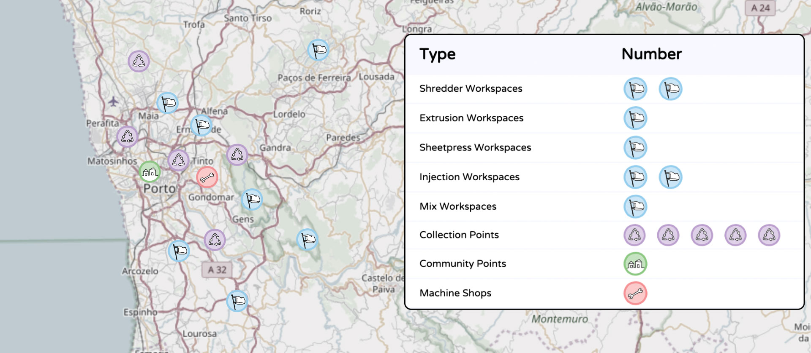

    

# How the Universe works

Hmm yes.. this is a bit of a tough question. Maybe its better to start with our own little one. The Precious Plastic Universe. How this this work, what are the roles and guidelines, how can we help etc. The universe is setup to be a big global ecosystem, people around the world collaborating on plastic recycling. In order to do this properly we need different people and different expertise. So within the universe there are different roles to choose, some more technical, some more social. Below an overview of the roles we currently have.

# Spaces in the Universe
Within the Universe we have different Spaces. Each Space plays a different role. In this way people can focus on their own task but locally all work together. Different Spaces have different task and you can recognise them with their icon and color.

| Icon   |  Mission |
|----------|----------------------|
|            | __Member__   Precious Plastic Members are the beginning and the end of the plastic cycle. They provide the initial plastic waste and buy Precious Plastic recycled products.    |
|         |  __Workspace__   A Precious Plastic Workspace is a place where plastic gets transformed from waste into valuable materials or products. There are five different workspaces: Shredder, Extrusion, Sheetpress, Injection and Mix. |
|      |  __Machine shops__   Machine Shops produce and build parts, moulds and entire machines for other workspaces and projects in the local recycling network.   |
|   |  __Community Point__   Community Points connect and grow the network locally. Strengthening the existing local community while bringing in more & more people.  |
|  |  __Collection Point__   Collection Points gather plastic from neighbours, organisations and businesses to be used by local Shredder Workspaces.   |

Note: At this moment Collection Points have the toughest task. They require a lot of community work, building local awareness and have a difficult business model (still figuring out). They really rely on people power. So make sure to support them. Bring them cookies 🍪

# The amount of Spaces locally.

It's hard to say how many recycling Spaces you need in your local region. It depends on the density, amount of people and the volume of plastic they use. But to give you an indication here you can see the ratio between workspaces. Most noticeable: There are a big amount of Collection Points needed to gather the plastic, specially in the beginning to educate the people. And only 1 Community Point. In this way there is one point where Spaces can come together and collaborate with eachother.

# Start you Space in the Universe

There are a few things to take in account when setting up a Space.

- **What are your skills:** Probably the most importantone is to see what your skills are and what you like to do. Machine Shops are very technical, Community Points are more social and about connecting people. Each Space is quite different, so we highly recommend to first explore and compare them in our starterkit section on the website. This gives a good indication what fits you.

- **What is locally needed:** How many Spaces are there already and what is needed in my local area. Best is to go to our map, look around and get in touch with a Community Point, if there is one to learn more.

- **What is your budget** We like it if people can sustain themselves in the long run, setting your Space up as a business helps a lot to achieve this. But each Space does this a bit different, some require high investments, some not. Take this in account before you want to start

# Become part of a global ecosystem
It's fun to be part of a global community of like minded people, you can always find a place to sleep around the world :). But it's also just really really useful. On the one hand you can use our [Discord](https://discordapp.com/invite/rnx7m4t) to share ideas, suggestion or find answers to your questions. And we have our online [community-platform](https://community.preciousplastic.com) where you can find much more information, hacks, and improvements generated by members around the world. This information you can just take, but its also good to give back towards and share the things we learn. So we all work locally, but share knowledge globally.
